# SecuQuest (시큐퀘스트)

> 웹 보안 핵심 취약점을 **직접 공격해 보고, 막는 법까지** 배우는 한국어 실습형 학습 플랫폼
> 부트캠프 캡스톤 프로젝트 (Topic 05) · 5팀_Security Learning Platform · 오현명
> **포트폴리오:** [웹 페이지](https://gusaud9424-source.github.io/Final-Project/) · [PDF (5쪽)](docs/SecuQuest_portfolio.pdf)

    

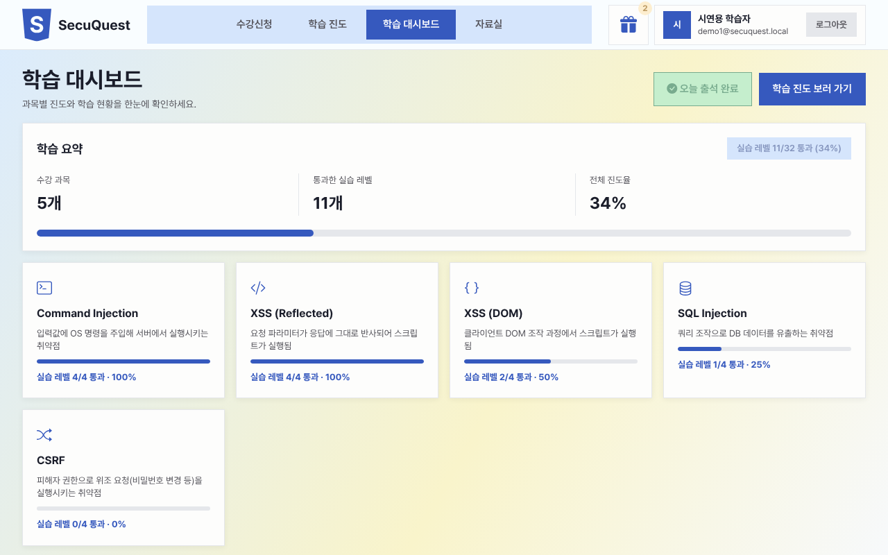

---

## 목차

1. [한눈에 보기](#한눈에-보기)
2. [화면](#화면)
3. [학습 흐름](#학습-흐름)
4. [빠른 시작](#빠른-시작)
5. [5분 시연 순서](#5분-시연-순서)
6. [주요 기능](#주요-기능)
7. [기술 스택](#기술-스택)
8. [시스템 구조](#시스템-구조)
9. [보안 설계](#보안-설계)
10. [문제 해결 사례](#문제-해결-사례)
11. [프로젝트 구조](#프로젝트-구조)
12. [문서](#문서)
13. [Attribution (출처)](#attribution-출처)

---

## 한눈에 보기

| 항목 | 내용 |
|---|---|
| **무엇을** | 8개 취약점 과목(XSS Reflected · DOM · Stored, Command Injection, SQL Injection, SQL Injection Blind, File Upload, CSRF)을 **하 → 중 → 상 → 안전** 4레벨로 직접 실습 |
| **왜** | 취약점 이론만으로는 "왜 막아야 하는지" 와닿지 않는다 → 공격이 통하는 코드와 막히는 코드를 레벨별로 비교하며 학습 |
| **어떻게 안전하게** | 실습 코드는 네트워크가 끊긴 **격리 Sandbox 컨테이너**, XSS 는 **실습 전용 CSP + sandbox iframe** 에서만 실행. 서비스 자체는 CSP · CSRF · Rate Limit · 감사 로그로 보호 |
| **학습 동기** | 레벨 통과 기준 진도율, 경험치 · 레벨 · 포인트, 미션 보상, 출석 체크 |
| **운영** | 관리자 회원관리, 학생 진도 현황(레벨별 이탈 분석), 감사 로그(로그인 실패 포함) |
| **기간 · 용도** | 2026-08-24 ~ 2026-09-30 (이후 포트폴리오용 보완) · 학습 · 발표 · 포트폴리오 (상업적 사용 없음) |

---

## 화면

| 학습 진도 (레벨 기준 진도율) | 실습 (하 → 중 → 상 → 안전 순차 잠금) |
|---|---|
| 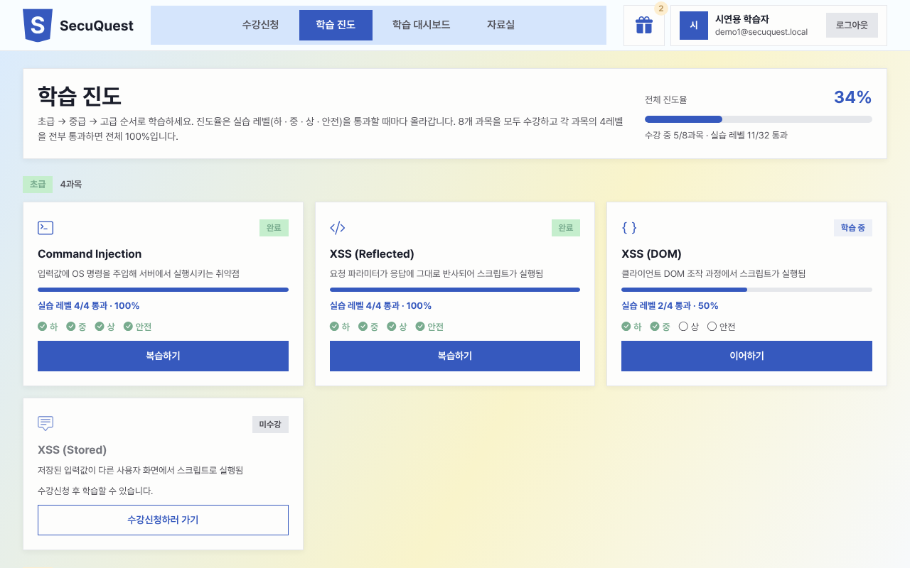 | 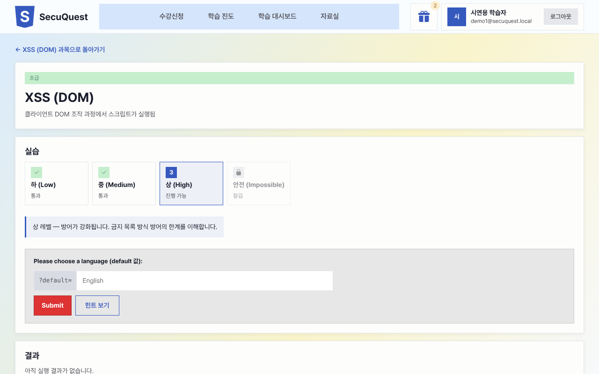 |
| **과목 상세 · 미션 보상** | **과목 정보 · 개념 확인 문제** |
| 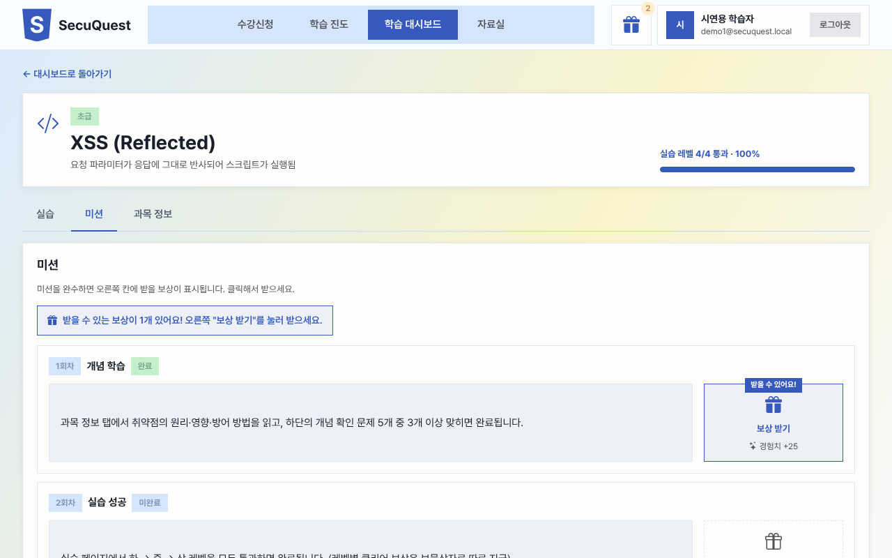 | 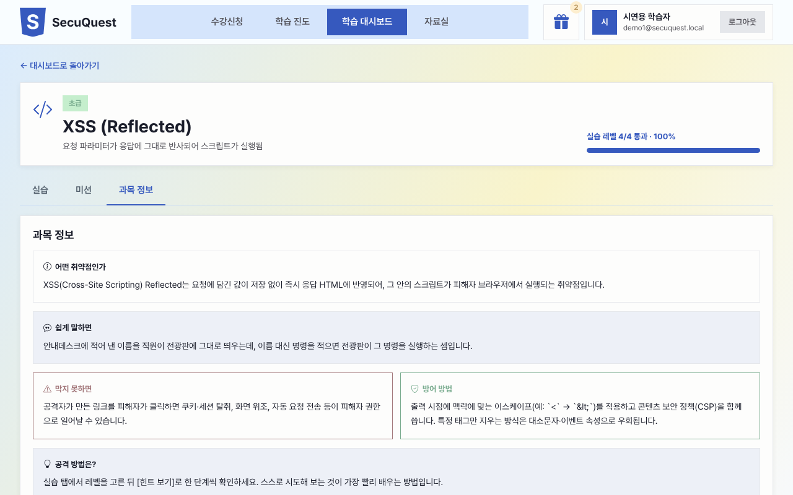 |
| **관리자 · 학생 진도 (레벨별 통과율)** | **관리자 · 감사 로그 (로그인 실패 감지)** |
| 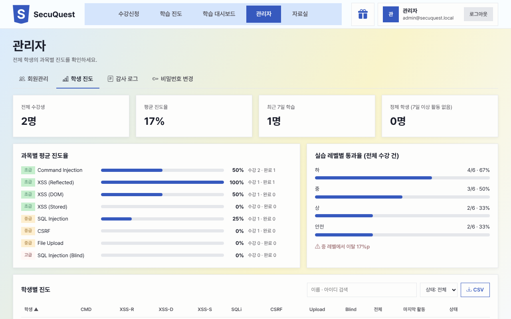 | 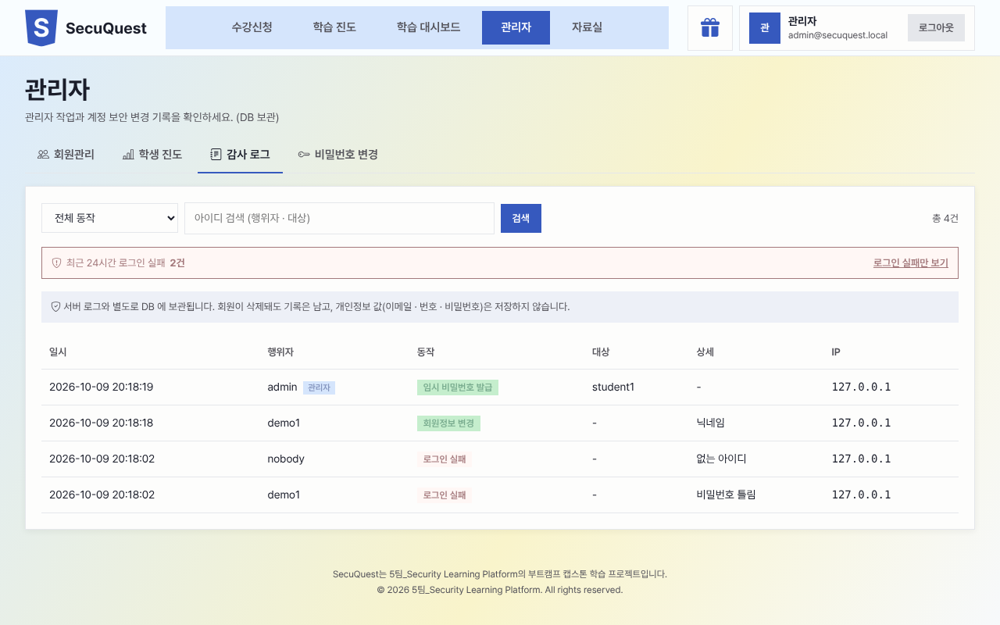 |
| **수강신청** | **로그인 (학생 / 관리자)** |
| 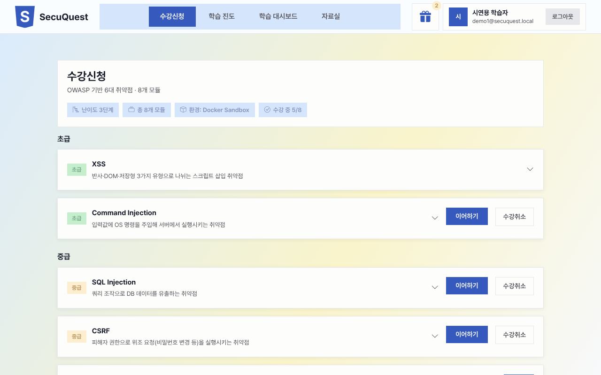 | 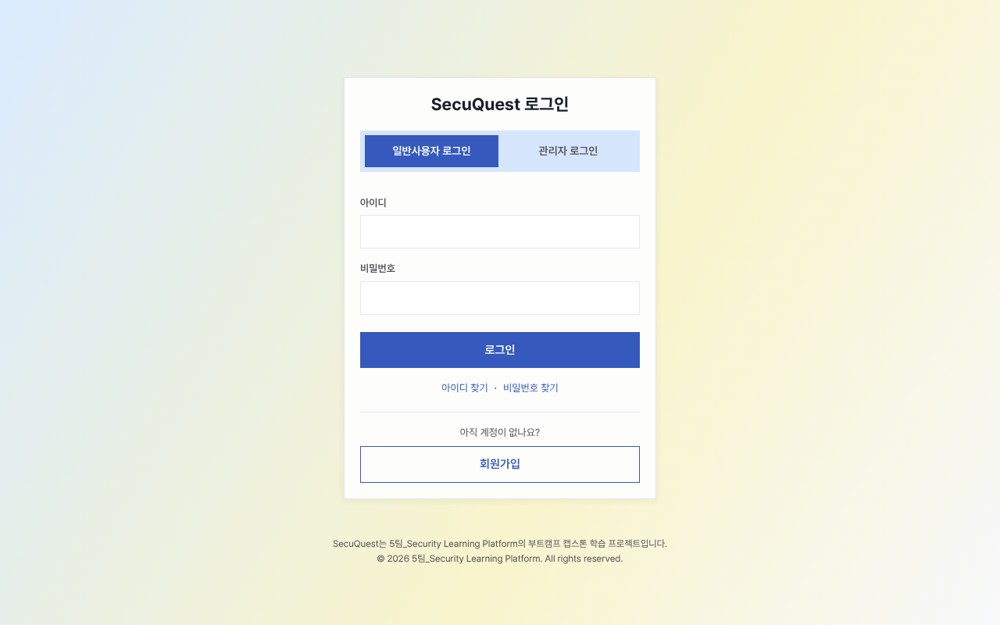 |

---

## 학습 흐름

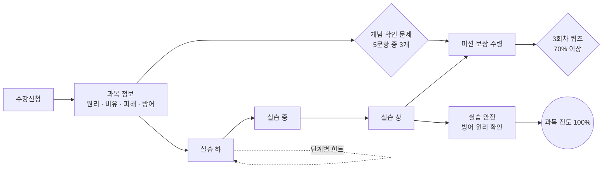

- **진도율 = 실습 레벨 통과 수.** 과목당 4레벨, 전체 8과목 × 4 = 32레벨을 모두 통과하면 100%.
- 이전 레벨을 통과해야 다음 레벨이 열린다(화면 + 서버 403 이중 검사). 막히면 **[힌트 보기]** 로 한 단계씩.
- 개념 확인 문제 · 퀴즈 · 미션은 진도율과 별개로 **경험치 · 포인트 보상**을 준다.

---

## 빠른 시작

**준비물:** Docker Desktop, Git

```bash
git clone https://github.com/gusaud9424-source/Final-Project.git
cd Final-Project
cp .env.example .env && cp backend/.env.example backend/.env   # 그대로 써도 실행됨

docker compose up -d --build
docker compose exec backend flask db upgrade   # DB 테이블 생성 (업데이트 후에도 다시 실행)
docker compose exec backend python seed.py     # 과목 · 시연 계정 생성
```

브라우저에서 **http://localhost:8090** 접속

| 아이디 | 비밀번호 | 역할 |
|---|---|---|
| `demo1` | `Student1234` | 학생 (시연용) |
| `student1` | `Student1234` | 학생 |
| `admin` | `Admin1234` | 관리자 — 로그인 화면에서 **[관리자 로그인]** 탭 선택 |

> - 시연용 비밀번호는 `backend/.env` 의 `SEED_ADMIN_PASSWORD` · `SEED_STUDENT_PASSWORD` 값입니다(**로컬 시연 전용**). 비워 두면 무작위로 만들어 seed 실행 시 한 번만 출력합니다.
> - 새 학생은 로그인 화면의 **[회원가입]** 으로 만들 수 있습니다.
> - 이메일(SMTP) · 문자(SMS) 키를 비워 두면 인증코드 발송만 동작하지 않고 나머지 기능은 모두 동작합니다.
> - 학생 · 관리자를 동시에 보려면 한쪽은 **시크릿 창**(Chrome `Ctrl+Shift+N`)을 쓰세요. 같은 브라우저는 로그인 쿠키를 공유합니다.
> - 비밀번호를 잊었다면: `docker compose exec backend flask set-password --username admin`
> - **SQL Injection · File Upload 의 중(Medium) 레벨**은 화면의 입력 제한(드롭다운 · 자동 Content-Type)을 넘어서야 하는 단계라, 실무처럼 브라우저 개발자 도구(DevTools)나 프록시 도구로 요청을 직접 바꿔야 합니다. "화면 제한만으로는 막을 수 없고 검증은 서버에서 해야 한다"(클라이언트 측 검증의 한계)를 보여 주는 의도된 설계입니다. 시연은 화면만으로 진행되는 다른 레벨 위주로 하세요.
> - ⚠️ 실습 페이지는 학습을 위해 **의도적으로 취약**합니다. 외부에 공개하지 말고 로컬에서만 실행하세요.

---

## 5분 시연 순서

면접 · 발표에서 그대로 따라 할 수 있는 순서입니다.

| # | 화면 | 보여줄 것 | 시간 |
|---|---|---|---|
| 1 | 로그인 → 학습 대시보드 (`demo1`) | 진도율 · 과목 카드 · 출석 체크 · 보물상자 | 30초 |
| 2 | 학습 진도 | 과목별 하 · 중 · 상 · 안전 통과 표시, 전체 32레벨 기준 진도율 | 30초 |
| 3 | 과목 상세 → 과목 정보 | 원리 · 비유 · 피해 · 방어 카드, 개념 확인 문제 | 40초 |
| 4 | 실습 (예: XSS Reflected) | 하 레벨에서 [힌트 보기] → 공격 성공 판정 → 다음 레벨 열림 | 1분 30초 |
| 5 | 실습 안전 레벨 | 같은 공격이 글자로만 표시되며 막히는 것 → [페이지 소스 보기]로 인코딩 확인 | 40초 |
| 6 | 미션 탭 · 보물상자 | 미션 보상 수령, 경험치 · 레벨 변화 | 30초 |
| 7 | 관리자 (시크릿 창, `admin`) | 학생 진도 · 레벨별 통과율 · 감사 로그(로그인 실패) | 40초 |

설명 포인트: "실습은 격리된 곳에서만 위험하게, 서비스는 표준 보안으로 안전하게" (→ [보안 설계](#보안-설계), [문제 해결 사례](#문제-해결-사례))

---

## 주요 기능

| 구분 | 기능 |
|---|---|
| 학습 | 수강신청 · 과목 정보(원리 · 비유 · 피해 · 방어) · 개념 확인 문제 · 3회차 50문항 퀴즈 · 자료실 학습 문서 내려받기 |
| 실습 | 8과목 × 4레벨(하 → 중 → 상 → 안전) 순차 잠금, 단계별 힌트(열 때마다 포인트 차감 5P → 10P → 20P), 안전 레벨에서 방어 원리 확인 |
| 진도 · 동기부여 | 실습 레벨 통과 기준 진도율, 경험치 · 레벨 · 포인트, 레벨 클리어 보상(보물상자), 미션 보상, 14일 출석 체크판 |
| 회원 | 회원가입 · 로그인(학생 / 관리자) · 아이디 찾기(이메일 / 휴대폰 SMS) · 비밀번호 재설정 · 마이페이지(회원정보 · 비밀번호 변경) |
| 관리자 | 회원관리(검색 · 임시 비밀번호 · 삭제), 학생 진도 현황(과목별 · 레벨별 통과율 · 정체 학생 · CSV), 학생 개인 현황, 감사 로그(로그인 실패 24시간 집계) |

---

## 기술 스택

| 영역 | 사용 기술 |
|---|---|
| 프론트엔드 | Vue 3 (Composition API, `<script setup>`, JavaScript) · Vite · Vue Router 4 · Pinia · Axios · Bootstrap 5 (SCSS 오버라이드) · Bootstrap Icons · Pretendard |
| 백엔드 | Python 3.12 · Flask 3 · Flask-SQLAlchemy · Flask-Migrate · Flask-Session · Flask-WTF(CSRF) · Flask-Limiter · bcrypt |
| 데이터 | MariaDB 11.4 (Docker Volume) · Redis 7 (세션 · Rate Limit) |
| 인프라 | Docker Compose · Nginx 1.27 (Reverse Proxy) · Practice Sandbox 컨테이너 |
| 외부 연동 | Gmail SMTP (이메일 인증코드) · Solapi (SMS 인증코드) |

---

## 시스템 구조

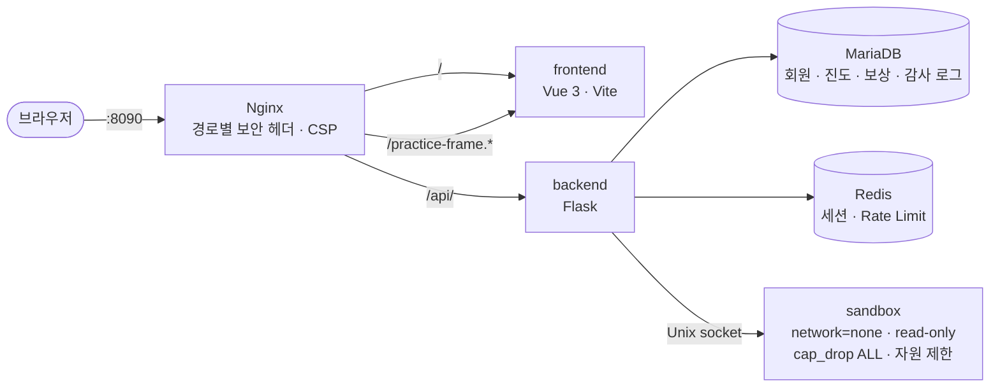

- 모든 포트는 `127.0.0.1` 에만 바인딩됩니다(외부 노출 없음). API 기본 경로 `/api/v1`.
- 실습 코드는 공유 볼륨의 Unix 소켓으로 Sandbox 컨테이너에 전달되어 그 안에서만 실행됩니다.
- XSS 실습 화면은 앱과 다른 CSP 가 붙는 `/practice-frame.html` 에서 `sandbox` iframe 으로 그립니다.

---

## 보안 설계

> ⚠️ **실습 페이지는 학습을 위해 의도적으로 취약하게 만들어졌습니다.** 외부 네트워크에 공개하지 말고 로컬에서만 실행하세요.

| 영역 | 적용 내용 |
|---|---|
| 실습 격리 | Sandbox 컨테이너: `network=none` · read-only rootfs · `cap_drop: ALL` · `no-new-privileges` · 메모리 128MB · PID 64 · CPU 0.5 · `/tmp` 16MB · XSS 실습은 iframe sandbox |
| 인증 | Redis 세션, 로그인 · 비밀번호 변경 시 세션 ID 재발급, bcrypt(salt round 12) |
| 쿠키 | HttpOnly · SameSite=Lax · 운영 모드에서 Secure |
| 요청 위조 | Flask-WTF CSRFProtect (실습 페이지 제외), Axios 가 `X-CSRFToken` 자동 첨부 |
| 남용 방지 | Flask-Limiter (로그인 분당 10회, 가입 · 인증코드 · 정보 변경 분당 5회) |
| 계정 보호 | 로그인 실패 기록(사유 구분, 관리자 24시간 실패 수 표시) · 없는 아이디도 bcrypt 비교로 응답 시간 통일, 아이디 찾기 · 비밀번호 찾기 응답에서 가입 여부 비노출, 인증코드 5분 만료 · 5회 오답 무효, 정보 변경 시 현재 비밀번호 재확인 |
| 권한 | 역할은 서버가 결정(가입 시 `student` 고정), 관리자 API 역할 검사 |
| 보안 응답 헤더 | Nginx 경로별 CSP(앱: `script-src 'self'` / API: `default-src 'none'` / XSS 실습 프레임: 인라인 허용 · 외부 통신 차단), `X-Frame-Options` · `frame-ancestors`(클릭재킹 방어), `nosniff`, `Referrer-Policy`, `Permissions-Policy`, `server_tokens off` |
| 감사 로그 | 관리자 작업 · 회원정보 변경 · 비밀번호 변경 · 비밀번호 찾기 재설정을 `audit_logs` 테이블(변경과 같은 트랜잭션)과 서버 로그에 기록, 관리자 [감사 로그] 탭에서 조회 (회원 삭제 후에도 보관, 개인정보 값은 기록하지 않음) |

---

## 문제 해결 사례

포트폴리오 · 면접에서 설명할 수 있도록 원인 → 해결 → 검증을 문서로 남겼습니다.

| 문제 | 해결 | 문서 |
|---|---|---|
| 엄격한 CSP 를 켜면 `srcdoc` iframe 이 부모 CSP 를 상속해 **XSS 실습이 동작하지 않음** | 실습 전용 페이지 `/practice-frame.html` 로 분리해 그 경로에만 실습용 CSP(인라인 허용 · 외부 통신 차단) 적용, `postMessage` 로 렌더링 → 앱은 `script-src 'self'` 유지 | [보안 헤더 · 404](docs/learning/%EB%B3%B4%EC%95%88%20%ED%97%A4%EB%8D%94%EC%99%80%20404/01_%EB%B3%B4%EC%95%88%ED%97%A4%EB%8D%94_404%ED%8E%98%EC%9D%B4%EC%A7%80.md) |
| 감사 로그가 서버 로그에만 있어 컨테이너를 지우면 사라짐 | `audit_logs` 테이블에 **변경과 같은 트랜잭션**으로 기록, 회원 삭제 후에도 보존, 개인정보 값 미기록, 관리자 조회 화면 | [감사 로그 DB 보관](docs/learning/%EA%B0%90%EC%82%AC%20%EB%A1%9C%EA%B7%B8%20%EB%B3%B4%EA%B4%80/01_%EA%B0%90%EC%82%AC%EB%A1%9C%EA%B7%B8_DB%EB%B3%B4%EA%B4%80.md) |
| 없는 아이디 로그인이 더 빨리 응답해 **응답 시간으로 가입 여부 노출** | 없는 아이디도 더미 해시로 bcrypt 비교, 로그인 실패를 사유별로 감사 로그에 기록 | [로그인 실패 기록](docs/learning/%EA%B0%90%EC%82%AC%20%EB%A1%9C%EA%B7%B8%20%EB%B3%B4%EA%B4%80/03_%EB%A1%9C%EA%B7%B8%EC%9D%B8%EC%8B%A4%ED%8C%A8_%EA%B8%B0%EB%A1%9D.md) |
| 안전 레벨을 **열기만 해도 통과**되고, XSS 안전 레벨은 통과해도 화면이 갱신되지 않음 | "직접 시도한 요청"만 통과로 인정(`_is_attempt`), 통과 응답을 화면에 즉시 반영 | [안전 레벨 통과 처리](docs/learning/%EB%82%9C%EC%9D%B4%EB%8F%84%20%ED%95%99%EC%8A%B5%20%EA%B5%AC%EC%A1%B0/04_%EC%95%88%EC%A0%84%EB%A0%88%EB%B2%A8_%ED%86%B5%EA%B3%BC%EC%B2%98%EB%A6%AC_%EC%88%98%EC%A0%95.md) |
| `.env.example` 을 그대로 복사하면 빈 값 때문에 **서버가 뜨지 않거나 로그인 세션이 깨짐** | 빈 환경변수는 기본값 사용, 시드 계정 비밀번호 처리 수정 → 클론 직후 3줄로 실행 | 커밋 `fix(setup)` |
| 실습 코드가 서버를 위협할 수 있음 | Sandbox 컨테이너 격리(네트워크 없음 · 읽기 전용 · 권한 제거 · 자원 제한) 7개 항목 **실측 점검** | [Sandbox 격리 점검](docs/learning/Sandbox%20%EA%B2%A9%EB%A6%AC%EC%A0%90%EA%B2%80/01_Sandbox_%EA%B2%A9%EB%A6%AC%EC%A0%90%EA%B2%80.md) |

---

## 프로젝트 구조

```
Final-Project/
├── CLAUDE.md                 # 프로젝트 지침 (디자인 · 보안 · 커밋 규칙)
├── docker-compose.yml
├── nginx/nginx.conf          # Reverse Proxy · 경로별 보안 헤더(CSP)
├── sandbox/                  # 실습 코드 격리 실행 컨테이너
├── backend/
│   ├── app/
│   │   ├── auth.py           # 로그인 · 회원가입 · 아이디/비밀번호 찾기 · 로그인 실패 기록
│   │   ├── profile.py        # 프로필 · 마이페이지(회원정보 · 비밀번호 변경)
│   │   ├── courses.py        # 과목 · 실습 레벨 · 개념 확인 · 퀴즈 · 미션 보상
│   │   ├── progress.py       # 진도율(실습 레벨 기준) · 레벨 잠금
│   │   ├── audit.py          # 감사 로그 기록
│   │   ├── concept_check.py  # 1회차 개념 확인 문항 (비면 퀴즈 문항에서 출제)
│   │   ├── practice_builders/  # 취약점별 실습 생성기
│   │   ├── quiz_bank/        # 취약점별 퀴즈 문항
│   │   ├── rewards.py        # 경험치 · 포인트 · 보상
│   │   ├── attendance.py     # 출석 체크
│   │   ├── admin.py          # 관리자: 회원관리 · 학생 진도 · 감사 로그
│   │   └── models.py
│   ├── migrations/           # Alembic 마이그레이션
│   └── seed.py
├── frontend/
│   ├── public/practice-frame.*   # XSS 실습 전용 프레임 (별도 CSP)
│   └── src/
│       ├── assets/           # design-tokens.css · bootstrap-overrides.scss
│       ├── components/       # layout · practice(실습 · PracticeFrame) · dashboard · admin · auth
│       ├── views/            # *View.vue (라우트 화면)
│       ├── stores/           # Pinia
│       ├── router/
│       └── api/client.js     # Axios (baseURL: /api/v1, CSRF 자동 첨부)
└── docs/                     # 설계 · API · 작업 기록 · 개념 설명 · images(README 스크린샷)
```

---

## 문서

| 위치 | 내용 |
|---|---|
| `docs/architecture/` | 시스템 아키텍처 |
| `docs/api/` | API 명세 |
| `docs/erd/` | DB 설계 |
| `docs/worklog/` | 단계별 작업 기록 |
| `docs/learning/` | 기능별 작업 기록 + 입문자용 개념 설명 |
| `docs/notes/` | 개발 환경 점검표 · 기능 점검 |

---

## Attribution (출처)

### 디자인 · 브랜드

- **레이아웃:** 화면 레이아웃 구조는 **모두의연구소(Modulabs) AX 교육 프로그램의 공개된 UI**에서 영감을 받아 SecuQuest에 맞게 재구성했습니다. 부트캠프 학습 목적으로만 사용하며, 원본의 코드 · 이미지 · 문구는 사용하지 않았습니다.
- **로고:** HTML5 방패 심볼 형태는 **W3C의 공개 HTML5 마크**에서 영감을 받아, 글자를 "S"로 재해석한 **SecuQuest 오리지널 마크**입니다.
- **자체 자산:** 로고 · 프로젝트명 · 문구 · 아이콘 구성 · 학습 콘텐츠 · 데이터는 모두 SecuQuest 자체 자산입니다.
- 모든 페이지 컴포넌트 상단에 출처 주석이 들어 있고, 홈 · 로그인 · 관리자 화면 하단 푸터에 저작권 문구를 표시합니다.

### 오픈소스 · 폰트

| 이름 | 용도 | 라이선스 |
|---|---|---|
| [Vue](https://vuejs.org/) · [Vue Router](https://router.vuejs.org/) · [Pinia](https://pinia.vuejs.org/) · [Vite](https://vitejs.dev/) | 프론트엔드 프레임워크 · 빌드 | MIT |
| [Bootstrap](https://getbootstrap.com/) · [Bootstrap Icons](https://icons.getbootstrap.com/) | UI 컴포넌트 · 아이콘 | MIT |
| [Axios](https://axios-http.com/) | HTTP 클라이언트 | MIT |
| [Pretendard](https://github.com/orioncactus/pretendard) | 본문 폰트 (jsDelivr CDN) | SIL Open Font License 1.1 |
| [Flask](https://flask.palletsprojects.com/) 및 확장(SQLAlchemy · Migrate · Session · WTF · Limiter) | 백엔드 | BSD-3-Clause / MIT |
| [MariaDB](https://mariadb.org/) · [Redis](https://redis.io/) · [Nginx](https://nginx.org/) | DB · 세션 저장소 · 프록시 (Docker 이미지) | 각 프로젝트 라이선스 |

### 학습 참고

- 취약점 분류와 방어 원칙은 [OWASP Top 10](https://owasp.org/www-project-top-ten/) 등 공개 자료를 참고해 한국어로 새로 작성했습니다.

### 저작권

> SecuQuest는 5팀_Security Learning Platform의 부트캠프 캡스톤 학습 프로젝트입니다.
> © 2026 5팀_Security Learning Platform. All rights reserved.
