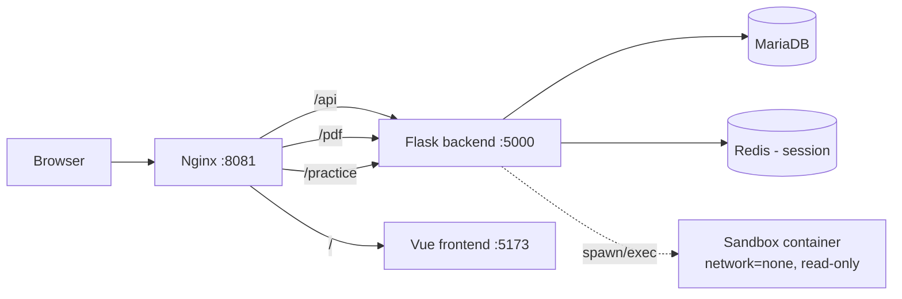

# 아키텍처 (v1 초안)

- Nginx: 리버스 프록시, 경로 기반 라우팅 (`/api` `/pdf` `/practice` → backend, 그 외 → frontend)
- Flask: SQLAlchemy(MariaDB) + Flask-Migrate, Flask-Session(Redis)
- Sandbox: 실습 코드 실행용, backend가 요청 시 격리 컨테이너 생성(network=none/read-only/cap_drop=ALL) — compose의 sandbox 서비스는 정책 검증용 템플릿

## 확정 필요 (셀프 체크)
- [ ] 실습 코드 실행 흐름(backend → sandbox 동적 생성) 상세 설계
- [ ] PDF 모듈 역할(다운로드/리포트 생성 등) 구체화
