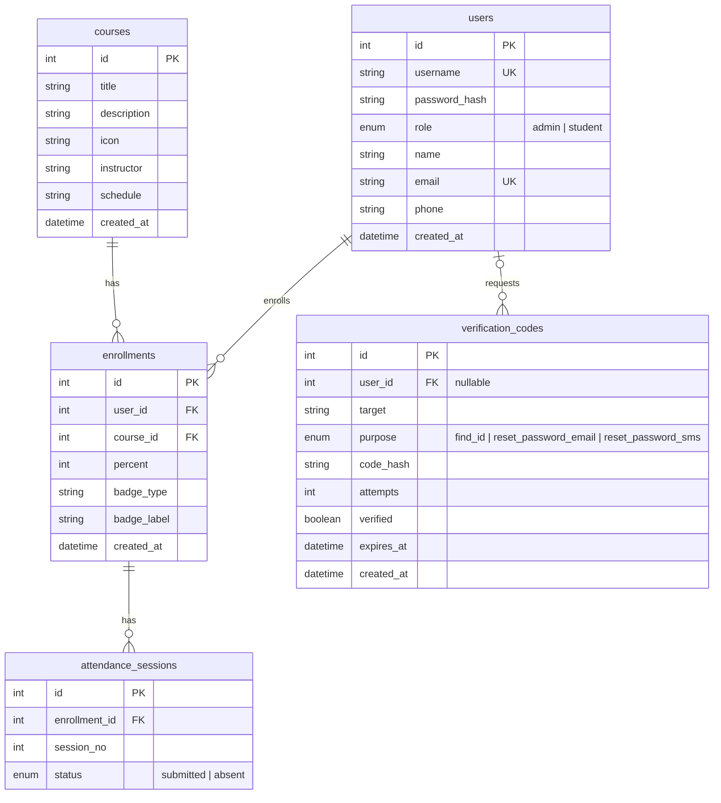

# 인증/학습 데이터 ERD

## Mermaid ER Diagram

## 유니크 제약 · 인덱스

Mermaid erDiagram 표기로는 복합 제약을 직접 표현할 수 없어 별도로 정리한다.

| 테이블 | 제약/인덱스 | 대상 컬럼 | 목적 |
|---|---|---|---|
| `users` | UNIQUE | `username` | 로그인 아이디 중복 방지 |
| `users` | UNIQUE | `email` | 아이디/비밀번호 찾기 시 계정 식별 |
| `enrollments` | UNIQUE (복합) | `user_id, course_id` | 동일 강의 중복 수강 방지 |
| `attendance_sessions` | UNIQUE (복합) | `enrollment_id, session_no` | 동일 회차 중복 출석 기록 방지 |
| `verification_codes` | INDEX (복합) | `target, purpose` | 인증코드 조회 성능 |

## 관계 요약

- `users` 1 : N `enrollments` — 사용자는 여러 강의를 수강할 수 있다.
- `courses` 1 : N `enrollments` — 강의는 여러 사용자에게 수강될 수 있다.
- `enrollments` 1 : N `attendance_sessions` — 수강 건마다 회차별 출석 기록을 가진다.
- `users` 1 : N `verification_codes` — 아이디/비밀번호 찾기 인증코드는 사용자에 연결되며(`user_id` nullable), 이메일 인증코드와 SMS 인증코드가 같은 `user_id`로 검증됐는지 `reset-password/confirm` 단계에서 확인한다.
