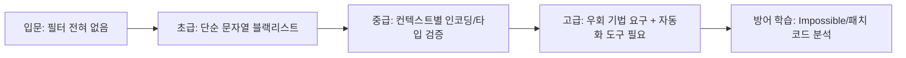

# 핵심 취약점 난이도 정리 (WebGoat / DVWA / bWAPP)

각 플랫폼이 자체적으로 제공하는 난이도 체계 기준으로 정리.

- **DVWA**: 페이지별 Low → Medium → High → Impossible (Impossible = 패치된 정답 코드)
- **bWAPP**: 앱 전체 보안 레벨 슬라이더 0(Low) / 1(Medium) / 2(High) — 취약점별 개별 난이도 라벨은 없고 전역 설정
- **WebGoat**: 난이도 라벨 대신 카테고리 내 레슨이 단계(Stage 1, 2, 3…)로 진행되며 뒤로 갈수록 방어 로직 우회 요구

---

## 1. Command Injection

**세부 종류**: OS 커맨드 결합(`;`, `&&`, `|`), 인자 삽입(argument injection), 블라인드 커맨드 인젝션(응답 지연/DNS로 결과 확인)

| 플랫폼 | 난이도 | 특징 |
|---|---|---|
| DVWA | Low | 필터 없음, `;`/`&&`로 바로 명령 연결 |
| DVWA | Medium | 일부 특수문자(`&&`, `;`) 블랙리스트 필터, 우회 가능 |
| DVWA | High | 더 강한 블랙리스트, 파이프(`|`) 등 우회 필요 |
| DVWA | Impossible | 화이트리스트 입력 검증 + `escapeshellarg` |
| bWAPP | Low | OS Command Injection 챌린지, 필터 거의 없음 |
| bWAPP | Medium/High | 보안 레벨 상승 시 일부 문자 이스케이프 |
| WebGoat | 단일 레슨(초급~중급) | 셸 메타문자 삽입 → 파일 목록 노출까지 유도 |

**난이도 순서(쉬움→어려움)**: DVWA Low < WebGoat < bWAPP Low ≈ DVWA Medium < DVWA High < bWAPP High < DVWA Impossible

---

## 2. XSS (DOM / Reflected / Stored)

**세부 종류**: Reflected XSS, Stored XSS, DOM-based XSS, (bWAPP 한정) XSS via HTTP 헤더/쿠키, mXSS

| 플랫폼 | 유형 | 난이도 | 특징 |
|---|---|---|---|
| DVWA | Reflected | Low | 인코딩/필터 없음 |
| DVWA | Reflected | Medium | `<script>` 문자열만 치환(대소문자 우회 가능) |
| DVWA | Reflected | High | 정규식 기반 필터, 이벤트 핸들러/기타 태그로 우회 |
| DVWA | Reflected | Impossible | `htmlspecialchars` 적용 |
| DVWA | Stored | Low~High | Reflected와 동일한 단계별 필터, 저장형이라 지속성 있음 |
| DVWA | DOM | Low~High | URL 프래그먼트(#) 기반, 클라이언트 JS 필터링 단계별 강화 |
| bWAPP | Reflected (GET/POST/JSON 등 다수) | Low/Medium/High | 입력 지점이 매우 다양(쿼리, 헤더, 쿠키 등) |
| bWAPP | Stored (블로그, 댓글 등) | Low/Medium/High | 저장 위치별 별도 챌린지 다수 |
| WebGoat | Reflected/Stored/DOM 각각 별도 레슨 | 초급~고급 단계 | DOM XSS는 클라이언트 사이드 sink(innerHTML 등) 이해 요구, 고급 단계에서 CSP 우회 등 포함 |

**난이도 체감**: DOM XSS(WebGoat 고급 단계, DVWA High) > Stored XSS High > Reflected XSS High > Low 단계 전반

---

## 3. SQL Injection

**세부 종류**: In-band(Union-based, Error-based), Stacked queries, 인증 우회(`' OR '1'='1`), 숫자형/문자형 파라미터 구분

| 플랫폼 | 난이도 | 특징 |
|---|---|---|
| DVWA | Low | 따옴표 이스케이프 없음, Union 기반 바로 성공 |
| DVWA | Medium | 숫자형 입력만 허용(드롭다운), Burp 등으로 요청 변조 필요 |
| DVWA | High | 세션 토큰 검증 추가, LIMIT 1로 결과 제한 우회 필요 |
| DVWA | Impossible | Prepared Statement 적용 |
| bWAPP | Low | GET/POST/Search 등 다양한 인젝션 포인트, 필터 없음 |
| bWAPP | Medium/High | 특수문자 일부 필터링, 우회 기법 요구 |
| WebGoat | 다단계 레슨(로그인 우회 → 데이터 추출 → Union → 2차 SQLi) | 초급~고급 | 마지막 단계는 컬럼 수 추정, Union 기반 전체 테이블 덤프까지 진행 |

**난이도 순서**: DVWA Low < bWAPP Low < WebGoat 초반 단계 < DVWA Medium < bWAPP Medium/High < DVWA High < WebGoat 고급(Union/2차) < DVWA Impossible/bWAPP 최고 레벨(방어 코드 학습용)

---

## 4. SQL Injection (Blind)

**세부 종류**: Boolean-based Blind, Time-based Blind, (부가) Error-based를 응답 차이로 유추

| 플랫폼 | 난이도 | 특징 |
|---|---|---|
| DVWA | Low | 참/거짓 응답만 다르게 나옴, 자동화 도구(sqlmap) 바로 적용 가능 |
| DVWA | Medium | 입력 형태 제한(숫자만) |
| DVWA | High | 세션/쿠키 검증 추가 |
| DVWA | Impossible | Prepared Statement + 안전한 오류 처리 |
| bWAPP | Blind(Boolean-based)/Blind(Time-based) 별도 챌린지 | Low/Medium/High | Time-based는 `SLEEP()` 응답 지연으로 참/거짓 판별해야 해서 체감 난이도 더 높음 |
| WebGoat | Blind SQLi 전용 레슨(참/거짓 → 문자 단위 추출) | 중급~고급 | 자동화 없이 수동으로 문자 단위 데이터 추출 요구, 가장 시간 소요 큼 |

**난이도 체감**: Boolean-based < Time-based (응답 지연 관찰 필요, 노이즈에 취약) — 전반적으로 일반 SQLi보다 한 단계씩 위

---

## 5. File Upload

**세부 종류**: 확장자 미검증, MIME 타입 우회, 매직바이트 우회, 이중 확장자(`.php.jpg`), 업로드 경로 접근 후 웹셸 실행

| 플랫폼 | 난이도 | 특징 |
|---|---|---|
| DVWA | Low | 확장자/타입 검증 없음, `.php` 바로 업로드 |
| DVWA | Medium | Content-Type(MIME) 검사만 존재, Burp로 헤더 조작 우회 |
| DVWA | High | 확장자 화이트리스트 + 이미지 매직바이트(GIF89a 등) 검사, 폴리글랏 파일 필요 |
| DVWA | Impossible | 서버 측 재인코딩(GD 라이브러리 등)으로 실행 코드 제거 |
| bWAPP | Unrestricted File Upload | Low/Medium/High | 레벨별 확장자/사이즈 검증 강화 |
| WebGoat | Insecure File Upload 레슨 | 중급 | 경로 조작(path traversal)과 결합해 웹 루트 밖 업로드까지 다룸 |

**난이도 순서**: DVWA Low < bWAPP Low < WebGoat < DVWA Medium < bWAPP Medium/High < DVWA High < DVWA Impossible

---

## 6. CSRF

**세부 종류**: 상태 변경 요청 위조(비밀번호 변경 등), GET 기반 CSRF, Referer/Origin 검증 우회, 토큰 없는/예측 가능한 CSRF 토큰

| 플랫폼 | 난이도 | 특징 |
|---|---|---|
| DVWA | Low | 토큰 전혀 없음, 외부 HTML 폼으로 바로 공격 |
| DVWA | Medium | Referer 헤더 검사(단순 문자열 포함 검사라 우회 가능) |
| DVWA | High | CSRF 토큰 존재, 토큰 유출/재사용 취약점 찾아야 함 |
| DVWA | Impossible | 토큰 검증 + 현재 비밀번호 재확인 |
| bWAPP | CSRF (비밀번호 변경 등) | Low/Medium/High | 레벨 상승 시 토큰 검증 강화 |
| WebGoat | CSRF 레슨(단순 위조 → 토큰 우회 → JSON CSRF) | 초급~고급 | 마지막 단계는 Content-Type이 JSON인 요청도 CSRF 가능함을 실습 |

**난이도 순서**: DVWA Low < bWAPP Low < WebGoat 초급 < DVWA Medium < bWAPP Medium/High < DVWA High < WebGoat 고급(JSON CSRF) < DVWA Impossible

---

## 종합 난이도 스케일 (교육 설계용 참고)

플랫폼 간 상대 난이도(대략): **DVWA Low ≈ bWAPP Low < WebGoat 초반 < DVWA Medium ≈ bWAPP Medium < DVWA High ≈ bWAPP High < WebGoat 고급 < DVWA Impossible**
