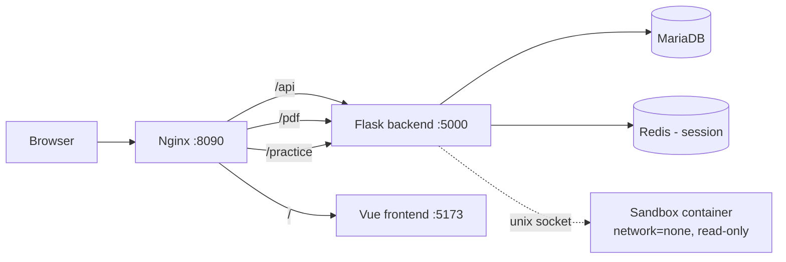

# 00. 프로젝트 개요

## 목적

SecuQuest는 웹 보안 6대 핵심 취약점을 한국어로 실습하며 배우는 부트캠프 캡스톤 학습 플랫폼이다.
대상 취약점은 다음 6가지이며, 그중 XSS와 SQL Injection은 세부 유형으로 나뉘어 실제로는 8개 실습 모듈(=과목)로 운영된다.

1. Command Injection
2. XSS (DOM / Reflected / Stored)
3. SQL Injection
4. SQL Injection (Blind)
5. File Upload
6. CSRF

용도는 학습·부트캠프 발표·포트폴리오이며 상업적 사용은 없다. (근거: 프로젝트 루트 `CLAUDE.md` 1절)

## 기술 스택

### 프론트엔드
- Vue 3 (Composition API, `<script setup>`)
- TypeScript 미사용 — 순수 JavaScript
- Bootstrap 5 (커스텀 SCSS 오버라이드, `frontend/src/assets/bootstrap-overrides.scss`)
- Vue Router 4
- Pinia (상태 관리, `frontend/src/stores/`)
- Axios (`baseURL: /api/v1`, `frontend/src/api/client.js`)
- Bootstrap Icons
- Pretendard Variable 폰트 (CDN)

### 백엔드
- Python 3 + Flask 3 (`backend/requirements.txt`)
- Flask-SQLAlchemy + Flask-Migrate(Alembic) — MariaDB 스키마 버전 관리
- Flask-Session — Redis 기반 세션 저장
- Flask-WTF — 전역 CSRF 보호
- Flask-Limiter — 라우트별 요청 속도 제한(Redis 백엔드 공유)
- MariaDB 11.4 (Docker Volume `dbdata`로 영속화)
- Redis 7 (세션·rate limit 저장소)
- Nginx (리버스 프록시, 정적 경로 라우팅)
- Docker Compose 기반 (Kubernetes 미사용)

### 인증
- 세션 기반 인증(Redis 세션 스토어). 로그인 성공 시 서버가 Flask 세션에 `user_id`를 저장하고,
  이후 요청은 세션 쿠키만으로 사용자를 식별한다(`backend/app/progress.py`의 `current_user()`가 모든 보호된 라우트에서 공통으로 쓰인다).
- bcrypt로 비밀번호 해시 저장.
- HttpOnly·Secure·SameSite 쿠키.

> **세션 기반 인증이란?** 로그인에 성공하면 서버가 세션 스토어(여기서는 Redis)에 "이 세션 ID는 몇 번 사용자다"라는 정보를 저장하고,
> 브라우저에는 세션 ID만 담긴 쿠키를 내려준다. 이후 요청마다 브라우저가 그 쿠키를 자동으로 함께 보내면 서버가 세션 ID로 사용자를 찾아낸다.
> 토큰을 프론트가 직접 관리하는 JWT 방식과 달리, 서버가 세션 상태를 쥐고 있어 즉시 로그아웃·만료 처리가 쉽다는 차이가 있다.

## 전체 아키텍처

(출처: `docs/architecture/architecture.md`. `/pdf`, `/practice` 상위 경로는 nginx 라우팅 규칙으로만 존재하며,
실제 백엔드 쪽 구현 범위는 이후 챕터에서 다룬다.)

### 컨테이너 구성 (`docker-compose.yml` 기준)

| 서비스 | 이미지/빌드 | 역할 | 비고 |
|---|---|---|---|
| nginx | `nginx:1.27-alpine` | 리버스 프록시, 경로 기반 라우팅 | `127.0.0.1:8090:80` 로컬호스트 전용 바인딩 ([02장](./02-phase2.md) 참고) |
| frontend | `./frontend` (Vite dev server) | Vue 개발 서버 | `./frontend:/app` 바인드 마운트, HMR |
| backend | `./backend` (Flask + `flask run --debug`) | REST API | `./backend:/app` 바인드 마운트, `127.0.0.1:5000` 노출 |
| db | `mariadb:11.4` | 데이터 영속화 | `dbdata` 볼륨 |
| redis | `redis:7-alpine` | 세션·rate limit 저장소 | |
| sandbox | `./sandbox` (Python 3.12-slim) | 실습 코드 격리 실행 | `network_mode: none`, `read_only: true`, `cap_drop: [ALL]`, `pids_limit: 64`, `mem_limit: 128m`, `cpus: 0.5` |

Nginx 라우팅 규칙(`nginx/nginx.conf`): `/api/`, `/pdf/`, `/practice/`는 backend(`:5000`)로,
그 외 모든 경로는 frontend(`:5173`)로 프록시한다.

### Sandbox 격리의 역할

실습 페이지(Command Injection 등)는 사용자가 입력한 값으로 실제 명령을 실행해야 학습 효과가 있다.
이걸 backend 프로세스 안에서 직접 실행하면 서버 자체가 공격당할 수 있으므로, 별도의 `sandbox` 컨테이너를 두고
backend는 그 컨테이너와 **유닉스 도메인 소켓**(`/ipc/sandbox.sock`, `sandbox_ipc`라는 이름의 Docker Volume으로 backend·sandbox
두 컨테이너에 공유 마운트됨)으로만 통신한다.

sandbox 컨테이너는:
- `network_mode: none` — 네트워크 인터페이스가 없어 외부로 나가는 통신 자체가 불가능
- `read_only: true` + `tmpfs: [/tmp]` — 루트 파일시스템은 읽기 전용, 쓰기는 `/tmp`(메모리 기반 임시 파일시스템)만 가능
- `cap_drop: [ALL]` + `security_opt: [no-new-privileges:true]` — 리눅스 특권 капabilities를 전부 제거
- `mem_limit`/`pids_limit`/`cpus` — 자원 남용(포크 폭탄 등) 방지

이 인프라가 어떻게 도입됐고 어떤 프로토콜로 동작하는지는 [04장](./04-phase3-5.md)에서,
실제로 이 채널을 사용하는 첫 실습 모듈(Command Injection)은 [05장](./05-command-injection.md)에서 다룬다.

## 개발 환경과 협업 방식

이 프로젝트는 한 사람이 여러 워크스테이션(집 PC 여러 대, 추후 교육장 노트북)을 오가며 진행한다.
Git 저장소(`gusaud9424-source/Final-Project`, 로컬 경로 `/mnt/c/study/project/Final-Prj`, WSL2)를 통해 코드를 주고받고,
각 워크스테이션마다 개발 환경(WSL2, Node, Docker, Claude Code)을 별도로 세팅해야 한다.

- `.env`(`backend/.env` 등)는 실제 비밀값을 담고 있어 git에 커밋하지 않는다. `.env.example`만 저장소에 있고,
  실값은 워크스테이션을 옮길 때마다 별도로 옮겨야 한다. (근거: `backend/.env.example` 파일 존재, `.gitignore`에 `.env` 계열 제외 규칙)
- 표준 작업 흐름(`CLAUDE.md` 8절): **pull → 작업 → commit → push**. DB 스키마가 바뀌는 작업 뒤에는 `flask db upgrade`로
  마이그레이션을 적용한다. 두 환경(교육센터·자택) 간 이동 시 반드시 push/pull로 동기화한다.
- 커밋 메시지는 Conventional Commits 형식(`feat(scope): 내용`)을 따른다. 로컬에 `gs`, `ga`, `gc`, `gp`, `gl` 같은 git alias를
  사용 중이다.
- 실제로 이 저장소는 작업 도중 워크스테이션을 옮겨 환경을 새로 세팅하고 이어서 진행한 이력이 있다 — 구체적으로 어느 커밋
  경계에서 옮겼는지는 git 이력만으로는 특정할 수 없어 [04장](./04-phase3-5.md) 서두에서 사용자 설명을 근거로 별도 표기한다.
