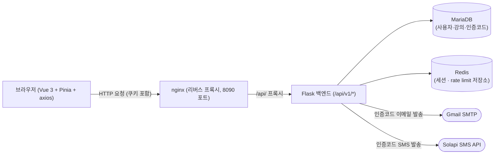

# SecuQuest 로그인 기능 작업 기록 (2026-09-23)

> 이 문서는 입문자도 따라올 수 있도록, 이번 세션에서 진행한 로그인/로그아웃/역할별 대시보드 기능 구현 과정을 시간 순서대로 정리한 작업 기록이다.
> 실제 비밀번호·인증코드·이메일·전화번호·IP·API 키 값은 전부 `********`, `user@example.com`, `010-0000-0000` 등으로 대체했다.

## 1. 목차

1. [목차](#1-목차)
2. [한눈에 보기](#2-한눈에-보기)
3. [작업 단계별 기록](#3-작업-단계별-기록)
   - [3.1 개발 환경 준비](#31-개발-환경-준비)
   - [3.2 환경변수(.env) 설정](#32-환경변수env-설정)
   - [3.3 백엔드 구현](#33-백엔드-구현)
   - [3.4 DB: 마이그레이션 · 시드 데이터](#34-db-마이그레이션--시드-데이터)
   - [3.5 Docker Compose 설정](#35-docker-compose-설정)
   - [3.6 프론트엔드 구현](#36-프론트엔드-구현)
   - [3.7 검증(API 테스트 · 실발송 테스트)](#37-검증api-테스트--실발송-테스트)
   - [3.8 Git 커밋 분리 · GitHub PR](#38-git-커밋-분리--github-pr)
   - [3.9 문서화(API 명세 · ERD)](#39-문서화api-명세--erd)
4. [문제 해결 기록(트러블슈팅)](#4-문제-해결-기록트러블슈팅)
5. [보안 설계 정리](#5-보안-설계-정리)
6. [용어 사전](#6-용어-사전)
7. [다음에 할 일](#7-다음에-할-일)

---

## 2. 한눈에 보기

- 헤더 좌측에 방패 모양 로고(`BrandMark.vue`)를 넣고, 클릭하면 대시보드로 이동하게 만들었다.
- 관리자/일반사용자 탭이 있는 로그인 화면, 로그아웃, 아이디 찾기, 비밀번호 찾기(이메일+SMS 2단계 인증)를 실제로 동작하게 구현했다.
- 학습 대시보드는 일반사용자에게는 본인 강의만, 관리자에게는 전체 학생 현황을 보여주도록 역할별로 나눴다.
- Flask 백엔드에 세션 로그인, bcrypt 비밀번호 해시, CSRF(다른 사이트가 내 로그인 상태를 몰래 이용해 요청을 보내는 공격) 방어, rate limit(짧은 시간에 너무 많은 요청을 막는 것)을 갖췄고, 실제 Gmail/Solapi로 인증코드까지 발송·검증했다.
- Docker Compose로 MariaDB·Redis·Flask·Vue·nginx를 전부 띄우고, 마이그레이션과 시드 데이터까지 만들어 실제로 로그인이 되는 상태까지 검증했다.

### 전체 구조



---

## 3. 작업 단계별 기록

### 3.1 개발 환경 준비

- **무엇을 했나**
  - 프론트엔드 개발 서버(Vite)를 백그라운드로 띄우려다 `pnpm` 이 시스템에 없어 실패했다.
  - `corepack prepare pnpm@latest --activate` 시도 시 권한 오류(`EACCES: permission denied`)로 실패했다.
  - `npx pnpm@latest` 로 재시도했으나 다운로드가 멈춰(응답 없음) 결국 `npm run dev` 로 전환했다.
  - WSL2(Windows용 리눅스) 환경에서 `http://localhost:5173` 접속이 안 되는 문제를 진단했다.
- **왜 필요한가**
  - `pnpm`은 이 프로젝트가 기본으로 쓰기로 한 패키지 매니저(재료를 챙겨주는 사람)지만, 이 환경에 설치가 안 돼 있어 프로그램을 실행할 수 없었다. 재료를 못 구하면 다른 재료로라도 요리를 시작해야 하듯, `npm`(같은 역할을 하는 다른 도구)으로 바꿨다.
  - WSL2는 리눅스를 윈도우 안에서 돌리는 방식인데, 가끔 "이 컴퓨터(localhost)" 라는 주소가 윈도우 쪽으로 자동 연결되지 않을 때가 있다. 마치 아파트 경비실(포워딩)이 가끔 소포를 못 찾는 것과 비슷하다.
- **어떻게 했나**
  ```bash
  # pnpm 설치 시도 (실패: EACCES 권한 오류)
  corepack prepare pnpm@latest --activate

  # npx pnpm 다운로드도 멈춰서 결국 npm으로 전환
  npm run dev   # vite --host 0.0.0.0
  ```
- **결과 / 확인 방법**
  - `npm run dev` 로 Vite 개발 서버(`http://localhost:5173`)가 정상 기동됨을 로그로 확인했다.
  - `localhost:5173` 은 처음엔 접속이 안 됐지만, WSL의 실제 IP 주소로는 접속이 됐다(IP 값은 세션·환경마다 달라지므로 이 문서에는 남기지 않는다). 이후 세션에서는 `localhost` 접속도 다시 됐는데, 정확한 복구 원인은 (확인 필요).

> 💡 **핵심 정리**: 이 환경엔 `pnpm`이 없어(권한 오류까지 확인) `npm`으로 대체했고, WSL2 특유의 `localhost` 포워딩 불안정 문제는 실제 IP 접속으로 우회했다(IP 값 자체는 문서에 남기지 않음).

### 3.2 환경변수(.env) 설정

- **무엇을 했나**
  - 사용자가 `backend/.env` 에 Gmail 앱 비밀번호, Solapi API 키, 시드용 학생 연락처(`SEED_STUDENT_EMAIL`, `SEED_STUDENT_PHONE`)를 직접 입력했다.
  - `backend/.env` 의 `DB_HOST`, `REDIS_HOST` 값이 `localhost` 로 잘못 들어있던 것을 `db`, `redis` 로 고쳤다.
  - 루트 `.env`(도커 컴포즈용, `DB_NAME`/`DB_USER`/`DB_PASSWORD`/`DB_ROOT_PASSWORD`)는 사용자가 직접 생성했다.
- **왜 필요한가**
  - `.env` 파일은 "비밀번호·주소록 같은 민감한 값을 코드 밖에 따로 적어두는 메모장" 이다. 코드에 직접 적으면 깃허브에 올릴 때 그대로 공개돼버리기 때문이다.
  - `DB_HOST=localhost` 는 "내 컴퓨터 자기 자신" 을 가리키는 주소인데, Docker Compose 안에서는 각 서비스가 독립된 작은 컴퓨터(컨테이너)처럼 동작해서 서로를 부를 때는 서비스 이름(`db`, `redis`)을 써야 한다. 아파트에서 "나"라고 부르면 안 되고 "몇 동 몇 호"라고 불러야 편지가 가는 것과 같다.
- **어떻게 했나**
  ```bash
  # DB_HOST/REDIS_HOST 만 정확히 치환 (다른 줄은 건드리지 않음)
  sed -i 's/^DB_HOST=localhost/DB_HOST=db/; s/^REDIS_HOST=localhost/REDIS_HOST=redis/' backend/.env

  # 값은 절대 출력하지 않고 키 이름만 존재 확인
  grep -oE '^[A-Z_]+=' backend/.env | sed 's/=$//'
  ```
- **결과 / 확인 방법**
  - `grep -E '^(DB_HOST|REDIS_HOST)=' backend/.env` 로 `DB_HOST=db`, `REDIS_HOST=redis` 확인.
  - `docker compose exec backend sh -c 'test -n "$SEED_STUDENT_EMAIL" && test -n "$SEED_STUDENT_PHONE" && echo OK'` 로 컨테이너 안에서 값이 정상적으로 읽히는지 확인(`OK` 출력).

> 💡 **핵심 정리**: 비밀 값은 `.env`에만 두고 절대 터미널에 출력하지 않았으며, "localhost vs 서비스 이름" 실수를 찾아 고쳤다.

### 3.3 백엔드 구현

#### `backend/config.py`

- **무엇을 했나**: `DATABASE_URL`/`REDIS_URL` 통짜 문자열 대신, `DB_HOST/PORT/NAME/USER/PASSWORD` 처럼 나뉜 값을 조립해 접속 주소를 만들도록 다시 작성했다. `python-dotenv`로 `.env`를 자동으로 읽게 했고, 비밀번호에 특수문자가 있어도 깨지지 않도록 URL 인코딩(`quote_plus`)을 적용했다.
- **왜 필요한가**: 비밀번호에 `@`나 `:` 같은 특수문자가 있으면 주소(URL) 문법과 충돌한다. 이름에 쉼표가 들어간 사람을 엑셀 CSV 파일에 그냥 적으면 칸이 밀리는 것과 비슷한 문제라, "이 문자는 특수문자입니다"라고 미리 인코딩해줘야 한다.
- **어떻게 했나**
  ```python
  # backend/config.py (발췌)
  def _build_database_uri():
      user = os.environ.get("DB_USER")
      password = quote_plus(os.environ.get("DB_PASSWORD", ""))  # 특수문자 인코딩
      host = os.environ.get("DB_HOST")
      port = os.environ.get("DB_PORT", "3306")
      name = os.environ.get("DB_NAME")
      return f"mysql+pymysql://{user}:{password}@{host}:{port}/{name}"

  class Config:
      # DATABASE_URL 이 있으면 그걸 쓰고, 없으면 위 함수로 조립
      SQLALCHEMY_DATABASE_URI = os.environ.get("DATABASE_URL") or _build_database_uri()
  ```
- **결과 / 확인 방법**: `docker compose restart backend` 후 로그에 `SESSION_REDIS_URL=None` 같은 오류 없이 정상 기동됨을 확인.

#### `backend/app/models.py`

- **무엇을 했나**: 기존 `User`(id, username, email)에 `password_hash`, `role`(admin/student), `name`, `phone`을 추가했다. `Course`, `Enrollment`(수강), `AttendanceSession`(출석), `VerificationCode`(인증코드) 테이블을 새로 만들었다.
- **왜 필요한가**: 로그인을 하려면 비밀번호와 "이 사람이 관리자인지 학생인지" 정보가 계정에 있어야 한다. 강의·출석·인증코드도 각각 별도 서랍(테이블)에 정리해야 나중에 찾기 쉽다.
- **어떻게 했나**
  ```python
  # backend/app/models.py (발췌)
  class Enrollment(db.Model):
      __tablename__ = "enrollments"
      __table_args__ = (
          db.UniqueConstraint("user_id", "course_id", name="uq_enrollment_user_course"),
      )
      # 같은 학생이 같은 강의를 중복 신청하지 못하게 유니크 제약을 걸었다.

  class VerificationCode(db.Model):
      __tablename__ = "verification_codes"
      code_hash = db.Column(db.String(64), nullable=False)  # 코드 원문이 아니라 해시로 저장
      attempts = db.Column(db.Integer, nullable=False, default=0)  # 틀린 횟수
      verified = db.Column(db.Boolean, nullable=False, default=False)
      expires_at = db.Column(db.DateTime, nullable=False)
  ```
- **결과 / 확인 방법**: 마이그레이션 실행 후 `flask db migrate` 로그에 `Detected added table 'courses'`, `'enrollments'`, `'verification_codes'`, `'attendance_sessions'` 가 출력됨을 확인.

#### `backend/app/auth.py`

- **무엇을 했나**: `GET /api/v1/auth/csrf`, `POST /api/v1/auth/login`, `POST /api/v1/auth/logout`, `GET /api/v1/auth/me`, 아이디/비밀번호 찾기용 발송·검증 엔드포인트를 만들었다. 자세한 요청/응답 형식은 [`docs/api/auth.md`](../api/auth.md) 참고.
- **왜 필요한가**: 로그인은 "이 사람이 맞는지"(비밀번호 확인) + "이 사람이 원하는 역할이 맞는지"(관리자 탭으로 로그인했는데 실제론 학생이면 거부)를 같이 확인해야 안전하다.
- **어떻게 했나 (여러 번 고친 순서대로)**
  1. 처음에는 로그인 성공 시 `session["user_id"] = user.id` 만 넣었는데, 사용자 피드백으로 **로그인 직전에 `session.clear()` 를 먼저 호출**하도록 고쳤다(세션 고정 공격 방지, [4장](#4-문제-해결-기록트러블슈팅) 참고).
  2. 아이디/비밀번호 찾기 코드는 처음에 그냥 `hashlib.sha256` 값만 비교했는데, 5회 틀리면 코드를 무효화하도록 `attempts` 카운트를 추가했다.
  3. 비밀번호 재설정의 `verify-codes` 는 처음엔 이메일 코드와 SMS 코드를 따로따로 확인해서 "이메일만 맞아도 verified로 바뀌는" 버그가 있었는데, **두 코드를 먼저 다 비교한 뒤 "둘 다 맞을 때만" `verified=True` 로 커밋**하도록 고쳤다.
  4. `reset-password/confirm` 은 처음엔 `_latest_active_code`(검증 안 된 코드 조회용)를 그대로 써서 "인증된 코드를 절대 못 찾는" 논리 오류가 있었다. `_latest_verified_code`(검증된 코드 전용 조회) 헬퍼를 새로 만들어 해결했다.
  5. 이메일/SMS 발송이 실패하면(`smtplib.SMTPException`, `OSError`, `requests.RequestException`) 계정이 있을 때만 500 오류가 나서 "이 계정은 존재하는구나"가 드러나는 문제가 있어, `try/except` 로 감싸고 **성공하든 실패하든 항상 같은 메시지**를 반환하게 했다.
  ```python
  # backend/app/auth.py (발췌) — 로그인 성공 시 세션 고정 방지
  session.clear()
  session["user_id"] = user.id
  session["role"] = user.role
  current_app.session_interface.regenerate(session)  # 세션 ID 자체를 새로 발급
  ```
- **결과 / 확인 방법**: [3.7 검증](#37-검증api-테스트--실발송-테스트) 절 참고.

#### `backend/app/mailer.py` / `backend/app/sms.py` / `backend/app/utils.py`

- **무엇을 했나**: `mailer.py` 는 Gmail SMTP로 이메일을 보내는 함수, `sms.py` 는 Solapi API 서명을 만들어 SMS를 보내는 함수를 담았다. 6자리 숫자 인증코드를 만드는 `generate_numeric_code` 는 처음엔 `sms.py` 안에 있었는데, 이메일 인증에도 같이 쓰이는 공용 기능이라 `utils.py` 로 분리했다.
- **왜 필요한가**: "문자 보내기"와 "인증코드 만들기"는 서로 다른 역할이라 한 파일에 몰아넣으면 나중에 찾기 어렵다. 공구함에서 드라이버와 못을 따로 정리하는 것과 같다.
- **어떻게 했나**
  ```python
  # backend/app/mailer.py (발췌)
  with smtplib.SMTP(config["MAIL_SERVER"], config["MAIL_PORT"], timeout=10) as server:
      if config["MAIL_USE_TLS"]:
          server.starttls()
      server.login(config["GMAIL_ADDRESS"], config["GMAIL_APP_PASSWORD"])
      server.send_message(message)  # sendmail 대신 send_message 사용
  ```
  ```python
  # backend/app/sms.py (발췌) — Solapi 서명 생성
  signature = hmac.new(
      api_secret.encode("utf-8"), (date + salt).encode("utf-8"), hashlib.sha256
  ).hexdigest()
  ```
- **결과 / 확인 방법**: [3.7 검증](#37-검증api-테스트--실발송-테스트) 절에서 실제 발송·수신까지 확인.

#### `backend/app/dashboard.py`

- **무엇을 했나**: `GET /api/v1/dashboard`(로그인한 사람이 학생이면 본인 강의만, 관리자면 전체 학생), `GET /api/v1/admin/students`(관리자 전용 전체 학생 목록)를 만들었다.
- **왜 필요한가**: 학생은 "내 성적표"만 봐야 하고, 관리자는 "전체 학생 성적표"를 봐야 한다. 같은 창구인데 신분증에 따라 다른 서류를 내주는 것과 같다.
- **어떻게 했나 (N+1 쿼리 개선 과정)**
  - 처음엔 학생 목록을 가져온 뒤, 학생 한 명 한 명마다 또 `Enrollment.query.filter_by(...)` 를 따로 날렸다. 학생이 100명이면 쿼리가 101번(N+1) 나가는 구조였다.
  - 사용자 피드백으로 `selectinload`/`joinedload` 를 이용해 **한 번(또는 소수)의 쿼리로 학생+수강+강의+출석을 한꺼번에** 가져오도록 고쳤다.
  ```python
  # backend/app/dashboard.py (발췌, N+1 개선 후)
  students = (
      User.query.filter_by(role="student")
      .options(
          selectinload(User.enrollments).joinedload(Enrollment.course),
          selectinload(User.enrollments).selectinload(Enrollment.attendance_sessions),
      )
      .all()
  )
  ```
- **결과 / 확인 방법**: 개선 전후로 `GET /api/v1/admin/students` 응답 내용(학생 1명, 강의 1건, 출석 4회차 2/4)이 동일함을 재확인했다.

#### `backend/app/__init__.py`

- **무엇을 했나**: `CSRFProtect`(CSRF 방어), `Limiter`(rate limit), 새 블루프린트(`auth`, `dashboard`) 등록, `CSRFError` 전용 오류 처리기를 추가했다.
- **왜 필요한가**: 블루프린트는 "기능별로 나뉜 작은 서랍"이다. 로그인 관련 주소는 `auth.py`, 대시보드 관련 주소는 `dashboard.py`에 몰아넣고, 앱을 만들 때 그 서랍들을 한곳에 등록해야 실제로 동작한다.
- **어떻게 했나**
  ```python
  # backend/app/__init__.py (발췌)
  app.config["RATELIMIT_STORAGE_URI"] = app.config["SESSION_REDIS_URL"]  # rate limit도 Redis에 저장
  limiter.init_app(app)

  @app.errorhandler(CSRFError)
  def handle_csrf_error(_error):
      return jsonify(error="csrf", message="보안 토큰이 만료되었습니다. 다시 시도하세요."), 400
  ```
- **결과 / 확인 방법**: 재기동 로그에 "in-memory storage" 경고가 없음을 확인(→ Redis를 실제로 쓰고 있다는 뜻).

> 💡 **핵심 정리**: 로그인 API는 세션 고정 방지·CSRF·계정 존재 비노출까지 여러 차례 리뷰를 거쳐 고쳤고, 대시보드 API는 N+1 쿼리를 줄였다.

### 3.4 DB: 마이그레이션 · 시드 데이터

- **무엇을 했나**: `flask db init` → `flask db migrate` → `flask db upgrade` 로 새 테이블을 실제 DB에 반영했다. `backend/seed.py` 를 다시 작성해 관리자 계정 1개, 학생 계정 1개, 강의 1건, 수강 1건, 출석 4회차(2회 출석·2회 결석)를 넣었다.
- **왜 필요한가**: 마이그레이션은 "이사할 때 가구 배치도를 실제로 옮기는 작업"이다. 모델 코드만 고쳐서는 실제 데이터베이스 테이블이 바뀌지 않는다. 시드 데이터는 "테스트용 샘플 손님"을 미리 넣어두는 것으로, 이게 있어야 로그인이 실제로 되는지 확인할 수 있다.
- **어떻게 했나**
  ```bash
  # 반드시 sh -c 로 감싸서 컨테이너 안에서 && 까지 실행되게 함 (4장 참고)
  docker compose exec backend sh -c "flask db init && flask db migrate -m 'add auth, roles, courses' && flask db upgrade"

  docker compose exec backend python seed.py
  ```
  ```python
  # backend/seed.py (발췌) — 학생 연락처는 .env 값 사용(더미 값 금지)
  student, student_password = _seed_user(
      username="student1", role="student", name="학습자1",
      email=os.environ["SEED_STUDENT_EMAIL"],
      phone=os.environ["SEED_STUDENT_PHONE"],
  )
  ```
- **결과 / 확인 방법**: 마이그레이션 로그에 `Detected added table` 4건, `seed.py` 실행 후 `seed done` 출력, `backend/migrations/versions/` 에 파일이 생성됨을 확인.

> 💡 **핵심 정리**: 마이그레이션으로 DB 구조를 바꾸고, 시드로 로그인 테스트용 계정 2개를 만들었다.

### 3.5 Docker Compose 설정

- **무엇을 했나**: `backend` 서비스에 `env_file`(루트 `.env` + `backend/.env` 둘 다), `volumes`(`./backend:/app`, 마이그레이션 파일이 컨테이너 밖에도 남게), `ports`(`127.0.0.1:5000:5000`, 로컬에서만 접근 가능하게)를 추가했다. `frontend` 서비스에는 `VITE_API_TARGET: http://backend:5000` 환경변수를 추가했다.
- **왜 필요한가**: 컨테이너는 "일회용 밀폐 상자"라서, 안에서 만든 파일(마이그레이션)이 상자를 지우면 같이 사라진다. `volumes`는 "상자 밖 창고와 연결된 통로"를 만들어 파일을 보존한다. `ports`를 `127.0.0.1`로 제한한 건 "이 문은 우리 집 안에서만 열 수 있게" 잠근 것이다.
- **어떻게 했나**
  ```yaml
  # docker-compose.yml (발췌)
  backend:
    build: ./backend
    env_file:
      - .env
      - backend/.env
    volumes:
      - ./backend:/app
    ports:
      - "127.0.0.1:5000:5000"
    depends_on:
      db:
        condition: service_healthy
      redis:
        condition: service_healthy
  ```
- **결과 / 확인 방법**: `docker compose exec backend ls node_modules/pinia node_modules/axios`(프론트), `ls backend/migrations/versions/`(백엔드)로 파일이 컨테이너 밖에도 남아있음을 확인.

> 💡 **핵심 정리**: `env_file`을 2개로 늘리고, `volumes`로 마이그레이션을 보존하고, `ports`를 로컬 전용으로 좁혔다.

### 3.6 프론트엔드 구현

#### `frontend/src/api/client.js`, `errors.js`

- **무엇을 했나**: axios(웹 요청을 보내는 도구) 인스턴스를 만들고, GET이 아닌 요청 전에는 자동으로 CSRF 토큰을 붙이는 "인터셉터"(가로채서 처리하는 중간 다리)를 넣었다. 400 오류이면서 서버가 `{"error": "csrf"}` 를 보내면, 토큰을 새로 받아 **딱 한 번만** 재시도하도록 했다. 에러 메시지를 뽑아주는 `getErrorMessage(error, fallback)` 을 `errors.js` 로 분리해 여러 화면에서 재사용했다.
- **왜 필요한가**: 로그인하면 서버의 "출입증"(세션)이 새로 발급되는데, 그 전에 받아둔 CSRF 토큰은 무효가 된다. 매번 사람이 "토큰 다시 받아와" 라고 안 해도 되게, 자동으로 감지해서 한 번 더 시도해주는 장치다.
- **어떻게 했나**
  ```javascript
  // frontend/src/api/client.js (발췌)
  client.interceptors.response.use(
    (response) => response,
    async (error) => {
      const isCsrfError = error.response?.status === 400 && error.response?.data?.error === "csrf";
      if (isCsrfError && error.config && !error.config._csrfRetried) {
        error.config._csrfRetried = true;   // 무한 재시도 방지
        resetCsrfToken();
        error.config.headers["X-CSRFToken"] = await ensureCsrfToken();
        return client(error.config);        // 원래 요청 한 번만 재시도
      }
      return Promise.reject(error);
    }
  );
  ```
- **결과 / 확인 방법**: 코드 리뷰로 로직 확정(백엔드 curl 테스트에서 같은 상황이 재현됨을 확인, [4장](#4-문제-해결-기록트러블슈팅) 참고).

#### `frontend/src/stores/auth.js` (Pinia 스토어)

- **무엇을 했나**: 로그인한 사용자 정보(`user`), 앱이 "로그인 여부 확인을 이미 끝냈는지"(`initialized`)를 저장하는 Pinia(Vue의 상태 저장소) 스토어를 만들었다. `login`, `logout`, `fetchMe` 함수를 담았다.
- **왜 필요한가**: 여러 화면(헤더, 대시보드, 라우터 가드)이 "지금 로그인한 사람이 누구지?"를 똑같이 알아야 하는데, 매번 서버에 물어보면 느리다. 한 곳(스토어)에 저장해두고 다 같이 참조하는 "공용 게시판" 같은 것이다.
- **어떻게 했나**
  ```javascript
  // frontend/src/stores/auth.js (발췌)
  async function fetchMe() {
    try {
      const { data } = await client.get("/auth/me");
      user.value = data;
    } catch {
      user.value = null;
    } finally {
      initialized.value = true;  // 성공하든 실패하든 "확인은 끝냈다" 표시
    }
  }
  ```
- **결과 / 확인 방법**: 라우터 가드에서 `!auth.initialized` 일 때만 `fetchMe()` 를 기다리도록 연결(아래 라우터 절 참고).

#### `frontend/src/router/index.js`

- **무엇을 했나**: `/login`, `/find-id`, `/find-password` 라우트를 추가하고, 페이지 이동 전에 실행되는 "라우터 가드"(문지기)를 달았다. 로그인 안 했으면 `/login` 으로, 관리자 전용 페이지에 학생이 들어오면 `/dashboard` 로 돌려보낸다.
- **왜 필요한가**: 문지기가 없으면 로그인 안 한 사람도 URL만 알면 대시보드에 들어갈 수 있다. 놀이공원 입구에서 손목밴드를 확인하는 것과 같은 역할이다.
- **어떻게 했나**
  ```javascript
  // frontend/src/router/index.js (발췌)
  router.beforeEach(async (to) => {
    const authStore = useAuthStore();
    if (!authStore.initialized) {
      await authStore.fetchMe();  // 앱 켜지고 첫 이동에서만 서버에 확인
    }
    if (!to.meta.public && !authStore.isAuthenticated) return "/login";
    if (to.meta.requiresAdmin && !authStore.isAdmin) return "/dashboard";
    return true;
  });
  ```
- **결과 / 확인 방법**: (프론트 UI 직접 확인은 사용자가 브라우저에서 진행, 이 문서에서는 코드 확정 시점까지만 기록)

#### 화면(View) · 컴포넌트

- **`LoginView.vue`**: 관리자/일반사용자 탭, 아이디·비밀번호 입력, 아이디/비밀번호 찾기 링크.
- **`FindIdView.vue`**: 이메일 입력 → 인증코드 발송 → 코드 확인 → 아이디 표시.
- **`FindPasswordView.vue`**: 아이디 입력칸(공용) + 이메일 코드 발송/확인 + SMS 코드 발송/확인 + 새 비밀번호 설정. 아이디가 비어 있으면 서버에 요청하지 않고 "아이디를 먼저 입력하세요." 를 바로 보여주도록 고쳤다.
- **`AuthCard.vue`**: 로그인·아이디 찾기·비밀번호 찾기 3개 화면이 카드·탭·입력창·버튼 스타일을 반복해서 갖고 있던 것을, 제목(prop)과 내용(slot)만 받는 공용 카드로 분리했다. 이 리팩터링 후 세 화면 어디에도 `<style>` 블록이나 `AppFooter` import가 남지 않도록 `grep` 으로 확인했다.
- **`StudentsOverview.vue`**: 관리자용 전체 학생 표. 데이터 조회를 이 컴포넌트가 전담해서, `/dashboard`(관리자 화면)와 `/admin` 페이지에서 재사용한다.
- **`BrandMark.vue`**: SVG 파일 대신 Vue 컴포넌트로 만든 방패+"S" 로고. 방패 색은 `currentColor`(부모가 지정한 색을 그대로 씀)로 처리해 `color: var(--sq-color-accent)` 하나만 지정하면 되게 했다.
- **`AppHeader.vue`**: 로고+"SecuQuest" 를 `<router-link to="/dashboard">` 로 감싸 클릭 시 대시보드로 이동. 로그아웃 버튼은 `authStore.logout()` 호출 후 `/login` 으로 이동.
- **`AppFooter.vue`**: 저작권 표기 문구. 처음엔 `LoginView`/`DashboardView`/`AdminView` 각자 안에 넣었다가, `App.vue` 한 곳에서 헤더와 같은 조건(`route.meta.showHeader`)으로 한 번만 렌더하도록 옮겼다.
- **디자인 토큰**: `BrandMark.vue`의 "S" 글자 색으로 쓸 만한, "accent 배경 위 텍스트" 전용 토큰이 `design-tokens.css`에 없어서 `--sq-color-on-accent: #FFFFFF` 를 추가했다. 이 추가는 "새 토큰을 만들기 전에 반드시 먼저 확인받는다"는 규칙이 세워지기 전에 이뤄졌고, 사용자가 이를 사후에 승인하면서 **앞으로는 새 `--sq-*` 토큰을 추가하기 전에 반드시 먼저 확인받으라**고 지시했다. 이후 작업부터는 이 규칙을 지켰다.

> 💡 **핵심 정리**: 로그인/찾기 화면 3개는 `AuthCard` 공용 레이아웃으로 합쳤고, 헤더·푸터·로고를 역할별로 재사용 가능하게 분리했다.

### 3.7 검증(API 테스트 · 실발송 테스트)

- **무엇을 했나**: `curl` 로 CSRF 발급 → 로그인 → `/auth/me` → `/dashboard` 순서로 관리자/학생 각각 테스트했다. 역할 불일치 로그인, 학생의 관리자 API 접근, 로그아웃 후 세션 종료도 확인했다. 아이디 찾기(이메일 발송+검증), 비밀번호 찾기(이메일+SMS 발송+검증+비밀번호 변경)를 **실제로** 발송해 검증했다.
- **왜 필요한가**: 코드를 짰다고 끝이 아니라, "진짜로 그 사람인 척 요청을 보내봤을 때" 의도대로 막히거나 통과하는지 확인해야 한다. 자물쇠를 만들고 나서 진짜 열쇠와 가짜 열쇠로 둘 다 넣어봐야 하는 것과 같다.
- **어떻게 했나**
  ```bash
  # CSRF 토큰 발급 → 로그인 → 대시보드 조회 (요약)
  CSRF=$(curl -s -c cookie.txt "$BASE/api/v1/auth/csrf" | grep -oE '"csrf_token":"[^"]+"' | cut -d'"' -f4)
  curl -s -b cookie.txt -c cookie.txt -X POST "$BASE/api/v1/auth/login" \
    -H "X-CSRFToken: $CSRF" -d '{"username":"admin","password":"********","role":"admin"}'
  curl -s -b cookie.txt "$BASE/api/v1/dashboard"
  ```
- **결과 / 확인 방법** (실제로 관찰한 결과)

  | 테스트 | 기대 결과 | 실제 결과 |
  |---|---|---|
  | 관리자 정상 로그인 | 200 | 200, `role: admin` 반환 |
  | 잘못된 역할로 로그인(학생 계정 + role=admin) | 401 | 401 |
  | 관리자 `/dashboard` | 전체 학생 데이터 | `students: [...]` 1명, 강의 1건 반환 |
  | 학생 `/dashboard` | 본인 강의만 | 강의 1건(`Command Injection`, 진도 50%) |
  | 학생이 `/admin/students` 접근 | 403 | 403 |
  | 로그아웃 후 `/auth/me` | 401 | 401 |
  | 아이디 찾기 이메일 발송+검증 | `username` 반환 | 첫 시도는 5분 TTL 만료로 실패, 재발송 후 성공(`{"username":"student1"}`) |
  | 비밀번호 찾기 이메일+SMS 발송 → 검증 → 새 비밀번호 설정 | 성공 메시지 | 전부 성공, 새 비밀번호로 재로그인도 성공 |
  | 발송 관련 backend 로그 | "email send failed"/"sms send failed" 없어야 함 | 없음 확인 |

> 💡 **핵심 정리**: 정상/비정상 시나리오를 모두 `curl` 로 재현했고, 실제 이메일·SMS 발송까지 성공적으로 검증했다.

### 3.8 Git 커밋 분리 · GitHub PR

- **무엇을 했나**: 변경 사항을 기능 단위로 나눠 8개 커밋(`feat(config)`, `feat(auth)`×2, `feat(api)`, `feat(db)`, `chore(frontend)`, `feat(layout)`, `feat(view)`)으로 나눴다. 이어서 `docs/auth-login` 브랜치에서 문서 커밋 후 PR #2를 만들었다.
- **왜 필요한가**: 커밋 하나에 모든 변경을 다 넣으면, 나중에 "이 버그가 언제 생겼지?" 찾을 때 전체를 다 뒤져야 한다. 기능별로 나누면 "로그인 관련만", "화면 스타일만" 처럼 필요한 부분만 골라볼 수 있다.
- **어떻게 했나**
  ```bash
  # 커밋 전마다 .env / backend/.env 가 스테이징에 없는지 확인
  git add backend/config.py backend/.env.example .gitignore docker-compose.yml
  git diff --cached --name-only   # .env 안 보이면 정상

  git commit -m "feat(config): 분리형 DB/Redis 환경변수 조립 + docker-compose 백엔드 설정 보완"
  ```
- **결과 / 확인 방법**
  - `git log --oneline -8` 로 8개 커밋 확인.
  - `git status --short` 로 남은 변경 없음(무관한 `data/` 폴더 제외) 확인.
  - `git push -u origin docs/auth-login` → `gh pr create --base main --head docs/auth-login --fill` 로 PR #2 생성, 링크 전달. 병합은 사용자가 직접 진행. (GitHub 인증 관련 문제와 해결 과정은 [4장 트러블슈팅 #14](#4-문제-해결-기록트러블슈팅) 참고)

> 💡 **핵심 정리**: 커밋마다 `.env` 유출 여부를 확인한 뒤 8개 기능 단위로 나눴고, PR 생성까지만 하고 병합은 사용자가 직접 했다.

### 3.9 문서화(API 명세 · ERD)

- **무엇을 했나**: `docs/api/auth.md`(엔드포인트별 메서드·요청/응답·상태코드·CSRF·rate limit 표), `docs/erd/auth.md`(Mermaid ER 다이어그램 + 유니크 제약/인덱스 표)를 작성했다. `data/` 에 있던 프로젝트 문서 체크리스트를 `docs/` 로 옮겼다.
- **왜 필요한가**: 코드만 보고 "이 API가 뭘 받고 뭘 돌려주는지" 매번 파악하면 시간이 오래 걸린다. 문서는 "이 서랍엔 뭐가 들었는지" 적어둔 라벨과 같다.
- **어떻게 했나**: 표의 모든 행이 `|` 로 끝나는지, 문장이 중간에 안 잘렸는지 `grep` 으로 재점검했다.
  ```bash
  grep -n '^|' docs/api/auth.md   # 표 행 전수 확인
  ```
- **결과 / 확인 방법**: 표 행 전부 정상 종료 확인, ERD의 `users |o--o{ verification_codes`(0 또는 1개, nullable FK 반영)로 카디널리티 수정 확인.

> 💡 **핵심 정리**: API 명세와 ERD를 문서로 남기고, 예시 값에는 실제 계정 정보를 쓰지 않았다.

---

## 4. 문제 해결 기록(트러블슈팅)

| # | 증상 | 원인 | 해결 | 배운 점 |
|---|---|---|---|---|
| 1 | `docker compose up` 후 backend 컨테이너가 바로 종료됨 | `config.py` 가 `SESSION_REDIS_URL` 환경변수를 그대로 기대했는데, `.env` 에는 `REDIS_HOST/PORT/PASSWORD` 로 나뉘어 있어 값이 `None` 이었음 | `config.py` 를 분리형 값으로 주소를 조립하도록 재작성 | 환경변수 이름이 코드와 `.env` 양쪽에서 정확히 일치해야 한다 |
| 2 | (사전 예방) `docker compose exec backend flask db init && flask db migrate ...` 처럼 그냥 이어 쓰면 `&&` 뒤가 호스트 셸에서 실행될 위험 | `docker compose exec` 는 첫 명령 하나만 컨테이너에서 실행하고, `&&` 로 이어진 다음 명령은 내 컴퓨터(호스트)에서 실행되기 때문 | `docker compose exec backend sh -c "cmd1 && cmd2 && cmd3"` 처럼 통째로 컨테이너 안의 셸에 넘김 | 컨테이너 안에서 여러 명령을 연달아 실행하려면 반드시 `sh -c` 로 묶어야 한다 |
| 3 | curl로 로그인 후 로그아웃 요청이 `{"error":"csrf",...}` 로 실패 | 로그인 성공 시 세션을 `clear()`+재발급(`regenerate`)하는데, 로그아웃에는 로그인 *전에* 받은 오래된 CSRF 토큰을 그대로 재사용했음 | 로그인 *후* `/auth/csrf` 를 다시 호출해 새 토큰을 받아 로그아웃 요청에 사용 | 세션이 바뀌면 그 세션에 묶인 CSRF 토큰도 다시 받아야 한다(→ 프론트는 자동 재시도 로직으로 해결) |
| 4 | (설계 검토 중 발견, 실제 배포 전 수정) Flask-WTF 의 CSRF 오류가 기본값으로는 HTML 오류 페이지로 내려갈 수 있음 | `CSRFProtect` 에 전용 오류 처리기를 달지 않으면 기본 Flask 오류 페이지(HTML)가 내려감 | `@app.errorhandler(CSRFError)` 를 추가해 항상 JSON(`{"error":"csrf", ...}`)으로 응답 | (확인 필요: 핸들러 추가 전 실제 HTML 응답을 직접 관찰한 기록은 없음. 문제가 생기기 전에 미리 고쳤다) |
| 5 | 코드 리뷰 중 `limiter._storage_uri = ...` 로 내부(비공개) 속성을 직접 바꾸는 방식으로 처음 작성함 | Flask-Limiter의 저장소 설정은 공식적으로 `app.config["RATELIMIT_STORAGE_URI"]` 로 하게 되어 있는데, 비공개 속성을 직접 건드리는 임시방편으로 짰음 | `limiter.init_app(app)` 호출 전에 `app.config["RATELIMIT_STORAGE_URI"]` 를 설정하도록 수정 | 라이브러리의 "비공개(밑줄로 시작하는) 속성"은 언제든 바뀔 수 있어 공식 설정 방법을 써야 한다 |
| 6 | `npm install pinia axios` 후에도 프론트 컨테이너 안에 새 패키지가 안 보일 뻔함 | `docker-compose.yml` 에 `/app/node_modules` 익명 볼륨이 있어, 컨테이너를 그냥 재시작하면 예전 `node_modules` 가 그대로 남아있을 수 있음 | `docker compose up -d --build -V frontend` (`-V`: 익명 볼륨 재생성)로 재기동 | 익명 볼륨은 이미지를 다시 빌드해도 자동으로 안 비워지므로 `-V` 로 명시적으로 갱신해야 할 때가 있다 |
| 7 | 아이디 찾기 인증코드 검증이 "코드가 올바르지 않거나 만료되었습니다" 로 실패 | 발송 후 확인까지 대화가 오가며 5분 TTL이 지나버림 | DB에서 `expires_at`, `attempts` 를 직접 조회해 원인이 "오타"가 아니라 "만료"임을 확인 → 재발송 후 5분 안에 검증 | 보안 설계(짧은 TTL)가 테스트 속도에도 영향을 준다는 걸 감안해 재발송을 준비해둬야 한다 |
| 8 | `curl` 명령에서 이전에 저장한 `$CSRF_F` 변수가 다음 명령 실행 때 비어 있음 | 매 Bash 호출이 새 셸 프로세스라 이전 호출에서 설정한 셸 변수가 유지되지 않음(작업 디렉터리만 유지됨) | 같은 명령 블록 안에서 `curl` 로 CSRF 토큰을 다시 받아서 바로 사용 | 여러 명령에 걸쳐 값을 재사용하려면 파일(쿠키 파일 등)에 저장하거나, 한 블록 안에서 끝내야 한다 |
| 9 | (설계 검토 중 발견, 실제 실행 전 수정) `reset-password/confirm` 이 인증된 코드를 절대 찾지 못하는 논리 오류 | `_latest_active_code` 가 `verified=False` 인 코드만 조회하는 함수인데, `confirm` 단계에서는 이미 `verified=True` 로 바뀐 코드를 찾아야 했음 | `_latest_verified_code`(verified=True 전용) 헬퍼를 새로 만들어 `confirm` 에서 사용 | "검증 전 코드 조회"와 "검증 후 코드 조회"는 서로 다른 함수로 분리해야 헷갈리지 않는다 |
| 10 | (설계 검토 중 발견) 이메일 코드만 맞고 SMS 코드가 틀리면 이메일 코드만 `verified=True` 로 바뀌어 다음 시도가 꼬일 뻔함 | 두 코드를 각각 따로 확인하고 바로 커밋하는 구조였음 | 두 코드를 먼저 다 비교한 뒤, **둘 다 맞을 때만** 커밋하고 틀린 쪽만 `attempts` 를 올리도록 수정 | 여러 조건을 같이 만족해야 하는 로직은 "다 확인 → 한 번에 반영" 순서로 짜야 중간 상태가 꼬이지 않는다 |
| 11 | `git mv data/문서.md docs/문서.md` 실행이 거부됨 | `data/` 폴더가 `git`에 아예 추적되지 않는(untracked) 상태라 `git mv` 대상이 될 수 없음 | 일반 `mv` 로 옮긴 뒤 `git add` 로 새 위치에서 추적 시작 | `git mv` 는 이미 추적 중인 파일에만 쓸 수 있고, 새 파일은 `mv` + `git add` 로 처리해야 한다 |
| 12 | `docker compose logs` 실행이 "no configuration file provided: not found" 오류 | 같은 명령 블록 안에서 `cd` 로 임시 폴더(쿠키 파일 저장용)로 이동한 뒤, `docker compose` 명령을 그 폴더에서 실행해 `docker-compose.yml` 을 못 찾음 | 프로젝트 루트에서 별도 명령으로 `docker compose logs` 실행 | `docker compose` 계열 명령은 항상 `docker-compose.yml` 이 있는 폴더에서 실행해야 한다 |
| 13 | `git commit` 준비 중 `backend/migrations/` 가 커밋 대상 목록에 안 보임 | `.gitignore` 에 `backend/migrations/` 가 등록돼 있어 마이그레이션 파일이 전부 무시되고 있었음 | `.gitignore` 에서 해당 줄 삭제 | 처음엔 "아직 마이그레이션이 없어서" 지워뒀던 규칙이, 마이그레이션이 생긴 뒤에는 반대로 문제가 될 수 있다 — 정기적으로 재점검이 필요하다 |
| 14 | `git push` 실행 시 "Password authentication is not supported" 로 거부됨 | GitHub가 계정 비밀번호로 `git push` 인증하는 방식을 더 이상 지원하지 않고, 개인 액세스 토큰이나 `gh` CLI 인증을 요구하기 때문 | `sudo apt install -y gh` 로 GitHub CLI 설치 → `gh auth login` 실행(GitHub.com → HTTPS → Yes → Login with a web browser 선택) → WSL 환경이라 브라우저가 자동으로 열리지 않아 `github.com/login/device` 페이지에 코드를 직접 입력해 인증 완료 → `gh auth setup-git` 으로 git이 이 인증 정보를 쓰도록 연결 → 이후 `git push` 정상 동작 | 비밀번호로 바로 push하던 방식은 더 이상 안 되고, WSL처럼 GUI 브라우저가 자동으로 안 열리는 환경에서는 "기기 코드 입력"(device flow) 방식으로 인증해야 한다 |

---

## 5. 보안 설계 정리

| 방어 기법 | 막는 공격 | 쉬운 비유 | 이 프로젝트에서 쓰인 곳 |
|---|---|---|---|
| CSRF 토큰 | CSRF(다른 사이트에 로그인된 내 브라우저를 속여, 내가 모르는 사이 서버에 요청을 보내게 하는 공격) | 은행 창구에서 매번 "오늘의 암호"를 확인하는 것과 같다. 암호를 모르는 위조 요청은 걸러진다 | `GET /auth/csrf` 발급, 모든 POST 요청에 `X-CSRFToken` 헤더 필요 |
| 세션 고정 방지 | 세션 고정(공격자가 미리 만들어둔 세션 ID를 피해자가 로그인할 때 그대로 쓰게 만들어, 로그인 후에도 공격자가 그 세션으로 접근하는 공격) | 로그인하면 "출입증 번호 자체를 새로 발급"해서, 로그인 전에 누가 내 출입증 번호를 알고 있었어도 소용없게 만든다 | `auth.py` 로그인 성공 시 `session.clear()` + `session_interface.regenerate()` |
| bcrypt 비밀번호 해시 | 평문 비밀번호 유출(DB가 털렸을 때 비밀번호가 그대로 보이는 것), 무차별 대입 공격을 위한 사전 계산(레인보우 테이블) | 비밀번호를 "되돌릴 수 없는 잠금 방식"으로 한 번 더 감싸 저장한다. 자물쇠를 열쇠 없이 부수려면 시간이 아주 오래 걸리게 만든 것과 같다 | `models.py` `password_hash`, `auth.py` `bcrypt.hashpw`/`bcrypt.checkpw` |
| 인증코드 해시 + 시도 횟수 제한 | 인증코드 추측(0000~9999처럼 몇 번이고 찍어보는 공격), DB 유출 시 코드 원문 노출 | 코드 원문 대신 지문(해시)만 저장하고, 문 앞에서 5번 틀리면 그 코드는 아예 못 쓰게 잠근다 | `verification_codes.code_hash`(SHA-256), `attempts` ≥ 5 시 무효화, `hmac.compare_digest` 로 비교 |
| 계정 존재 여부 비노출 | 계정 열거(존재하는 이메일/아이디만 골라내 공격 대상 리스트를 만드는 것) | "그런 계정 없습니다"와 "코드를 보냈습니다"를 다르게 알려주면, 어떤 이메일이 실제 가입자인지 하나씩 확인할 수 있게 된다. 그래서 항상 같은 대답만 한다 | `find-id`/`reset-password` 발송 API가 계정 존재 여부와 무관하게 항상 같은 메시지 반환 |
| Rate limit(요청 횟수 제한) | 무차별 대입(비밀번호를 기계로 수천 번 시도), 인증코드 대량 발송으로 인한 스팸/비용 공격 | 창구 직원이 "한 사람당 1분에 몇 번만 응대" 규칙을 정해두는 것과 같다 | `flask-limiter` — 로그인 10/min, 코드 발송 5/min, 코드 검증 10/min |
| IDOR 방지(구조적) | IDOR(다른 사람의 자료 번호로 URL만 바꿔서 남의 정보를 보는 공격, 예: `/students/5` → `/students/6`) | 아예 "몇 번 학생 정보 주세요"라고 물어볼 수 있는 창구 자체를 만들지 않고, "로그인한 사람 본인 것만" 또는 "관리자면 전체"만 내주는 창구만 뒀다 | `GET /api/v1/dashboard`, `/api/v1/admin/students` 가 URL에 학생 ID를 받지 않고, 서버가 세션으로만 "누구인지"를 판단 |

---

## 6. 용어 사전

| 용어 | 쉬운 설명 | 이 프로젝트에서 쓰인 곳 |
|---|---|---|
| `.env` | 비밀번호·API 키 같은 값을 코드와 분리해 적어두는 설정 파일 | `backend/.env`, 루트 `.env` |
| amend | 마지막 커밋 내용을 고쳐서 다시 저장하는 것(새 커밋을 만드는 대신 이전 커밋을 덮어씀) | `git commit --amend --no-edit` 로 `AppFooter.vue`/`design-tokens.css` 를 이전 커밋에 포함 |
| API(Application Programming Interface) | 프로그램끼리 데이터를 주고받기 위한 약속된 방법 | `/api/v1/auth/*`, `/api/v1/dashboard` 등 |
| axios | 브라우저에서 서버로 HTTP 요청을 보내는 자바스크립트 도구 | `frontend/src/api/client.js` |
| bcrypt | 비밀번호를 안전하게 암호화(해시)하는 방식 중 하나 | `auth.py` 비밀번호 저장/확인 |
| Docker | 프로그램을 "컨테이너"라는 독립된 상자에 담아 어디서든 똑같이 실행하게 해주는 도구 | 전체 백엔드/프론트/DB 실행 환경 |
| Docker Compose | 여러 개의 Docker 컨테이너(DB, Redis, 백엔드 등)를 한 번에 정의하고 실행하는 도구 | `docker-compose.yml` |
| ERD(Entity Relationship Diagram) | 데이터베이스 테이블들이 서로 어떻게 연결되는지 그린 그림 | `docs/erd/auth.md` |
| Flask | 파이썬으로 웹 서버(API)를 만드는 가벼운 프레임워크 | `backend/app/` 전체 |
| IDOR(Insecure Direct Object Reference) | URL이나 요청 값의 ID만 바꿔서 남의 데이터에 접근하는 공격 | [5장](#5-보안-설계-정리) 참고 |
| JSON(JavaScript Object Notation) | `{"키": "값"}` 형태로 데이터를 주고받는 표준 형식 | 모든 API 요청/응답 |
| MariaDB | 이 프로젝트가 쓰는 관계형 데이터베이스(표 형태로 데이터를 저장) | `db` 컨테이너 |
| N+1 쿼리 | 목록 1개를 가져온 뒤, 목록의 항목 하나하나마다 또 쿼리를 날려서 총 N+1번 질문하게 되는 비효율 | `dashboard.py` `_students_overview` 개선 전/후 |
| nginx | 요청을 적절한 서버로 전달해주는 리버스 프록시(문지기) 서버 | `docker-compose.yml` nginx 서비스, 8090 포트 |
| ORM(Object-Relational Mapping) | 데이터베이스 테이블을 파이썬 클래스처럼 다룰 수 있게 해주는 방식 | SQLAlchemy 사용 부분 |
| Pinia | Vue 3용 상태 저장소(스토어) 라이브러리 | `frontend/src/stores/auth.js` |
| PR(Pull Request) | "이 브랜치의 변경을 main에 합쳐도 될까요?" 라고 요청하는 GitHub 기능 | PR #1(`feat/auth-login`), PR #2(`docs/auth-login`) |
| rate limit | 정해진 시간 안에 요청을 몇 번까지만 허용하는 제한 | `flask-limiter`, 로그인/코드 발송/검증 API |
| Redis | 세션·요청 횟수 같은 정보를 빠르게 저장하는 메모리 기반 저장소 | 세션 저장소, rate limit 저장소 |
| REST | URL과 HTTP 메서드(GET/POST 등)로 자원을 다루는 API 설계 방식 | `/api/v1/*` 전체 구조 |
| SMTP(Simple Mail Transfer Protocol) | 이메일을 보낼 때 쓰는 표준 통신 규약 | `mailer.py`, Gmail SMTP |
| SQLAlchemy | 파이썬에서 데이터베이스를 다루게 해주는 ORM 라이브러리 | `models.py`, `db.Model` |
| Vue | 프론트엔드(화면)를 만드는 자바스크립트 프레임워크 | `frontend/src/` 전체 |
| axios 인터셉터 | 요청을 보내거나 응답을 받기 직전에 가로채서 공통 처리를 끼워 넣는 기능 | CSRF 토큰 자동 첨부, CSRF 오류 자동 재시도 |
| 라우터 | 어떤 URL로 들어왔을 때 어떤 화면을 보여줄지 정하는 프론트엔드 기능 | `frontend/src/router/index.js` |
| 라우터 가드 | 페이지 이동을 허용하기 전에 조건(로그인 여부 등)을 확인하는 문지기 로직 | `router.beforeEach` |
| 마이그레이션 | 데이터베이스 테이블 구조를 코드로 관리하고, 실제 DB에 순서대로 반영하는 작업 | `backend/migrations/` |
| 병합(merge) | 서로 다른 브랜치의 변경 내용을 하나로 합치는 것 | PR #1, #2 병합(사용자가 직접 진행, 병합 커밋 방식) |
| 볼륨(volume) | 컨테이너가 삭제돼도 데이터가 남도록 컨테이너 밖과 연결해두는 저장 공간 | `./backend:/app`, `/app/node_modules` |
| 블루프린트(Blueprint) | Flask에서 기능별로 URL과 처리 함수를 묶어놓는 단위 | `auth.py`, `dashboard.py`, `routes.py` |
| 브랜치(branch) | 원본 코드에서 갈라져 나와 독립적으로 작업할 수 있는 코드 사본 | `docs/auth-login`, `docs/worklog-auth` |
| 세션 | 로그인한 사용자를 서버가 기억하기 위해 발급하는 임시 출입증 같은 정보 | Flask-Session + Redis |
| 세션 고정 | 로그인 전 세션 ID를 공격자가 미리 알아내 로그인 후에도 그대로 악용하는 공격 | [5장](#5-보안-설계-정리) 참고 |
| 스토어(store) | 여러 화면이 공통으로 참조하는 상태(데이터)를 모아두는 곳 | Pinia `useAuthStore` |
| 시드(seed) | 개발·테스트용으로 미리 넣어두는 샘플 데이터 | `backend/seed.py` |
| 앱 비밀번호 | 원래 비밀번호 대신, 특정 프로그램(SMTP 등)에서만 쓰라고 구글 등이 별도로 발급하는 비밀번호 | Gmail SMTP 로그인(`GMAIL_APP_PASSWORD`) |
| 엔드포인트 | API에서 특정 기능을 담당하는 하나의 URL 주소 | `POST /api/v1/auth/login` 등 |
| 컨테이너 | Docker가 프로그램을 격리해서 실행하는 가벼운 실행 단위 | `backend`, `frontend`, `db`, `redis`, `nginx` 컨테이너 |
| 컴포넌트 | Vue에서 화면의 일부를 재사용 가능한 조각으로 만든 단위 | `AuthCard.vue`, `BrandMark.vue`, `StudentsOverview.vue` 등 |
| 커밋(commit) | 코드 변경 사항을 하나의 기록으로 저장하는 것 | 이번 세션 8개 + 문서 커밋 |
| 쿠키 | 브라우저가 서버로부터 받아 저장해두고, 다음 요청 때 자동으로 같이 보내는 작은 정보 조각 | 세션 쿠키(로그인 유지) |
| 토큰 | 신원이나 권한을 증명하기 위해 발급하는 문자열 값 | CSRF 토큰 |
| 프록시 | 요청을 대신 받아서 실제 서버로 전달해주는 중간 서버 | nginx(`/api/` → 백엔드), Vite `server.proxy` |
| 해시 | 원본 값을 되돌릴 수 없는 형태로 변환하는 것(같은 입력은 항상 같은 결과) | 비밀번호(bcrypt), 인증코드(SHA-256) |
| 환경변수 | 프로그램 실행 시 코드 밖에서 주입하는 설정 값 | `DB_HOST`, `GMAIL_APP_PASSWORD` 등 |
| fast-forward | 브랜치를 병합할 때, 별도의 병합 커밋 없이 포인터만 앞으로 이동시키는 방식 | 이번 세션의 PR #1, #2는 각각 별도의 병합 커밋(`b0aa93f`, `0bf814a`)을 남기는 방식으로 병합됐고, 병합 후 로컬에서 최신 내용을 반영(pull)할 때는 fast-forward로 처리됐다 |

---

## 7. 다음에 할 일

- [ ] 6대 취약점 실습 페이지(`VulnerabilityPage.vue` 공통 뼈대, `ChapterSelectView`/`ChapterDetailView`/`ResourcesView`)는 아직 스텁 상태 — 실제 구현 필요.
- [ ] `AdminView.vue`는 현재 전체 학생 현황 표만 있음 — 보상 승인, 사용자 관리 등 관리자 기능은 미구현.
- [ ] 운영 환경에서는 Flask 개발 서버(`flask run`) 대신 Gunicorn 등 프로덕션 WSGI 서버로 교체 필요.
- [ ] `SESSION_COOKIE_SECURE`는 현재 `FLASK_ENV == "production"` 일 때만 켜짐 — 실제 배포 시 HTTPS 적용 여부 재점검 필요.
- [ ] 인증코드 TTL(5분)·rate limit 수치는 초기값이며, 실사용 후 조정 여지가 있음.
- [ ] 백엔드/프론트 자동화 테스트(단위 테스트, E2E 테스트)가 아직 없음 — 이번 세션 검증은 전부 수동 `curl`/수동 로그인이었음.
- [ ] CI(지속적 통합) 파이프라인 미구성.
- [ ] 아이디/비밀번호 찾기의 SMS·이메일 발송 실패 시 관리자 알림(모니터링) 미구현.
- [ ] `data/` 폴더에 남아있던 다른 문서(체크리스트 외)가 더 있는지 (확인 필요).
